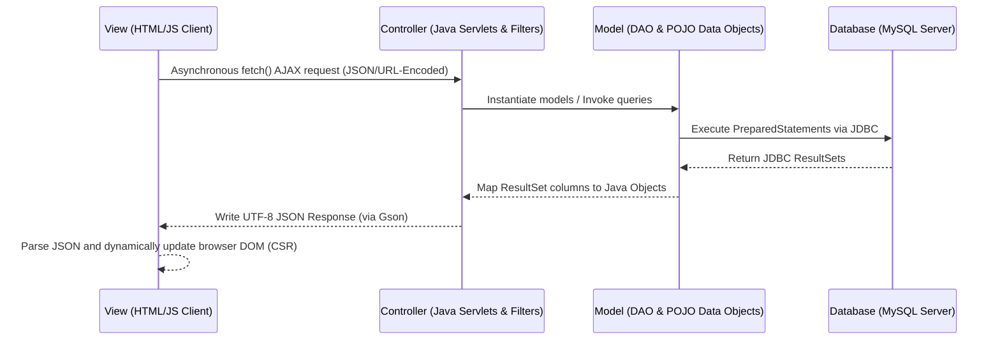

# BloodConnect — Donor & Request Matching System

BloodConnect is a web application built to connect patients/hospitals needing urgent blood with compatible, available donors nearby. The system manages donor profiles, availability cooling periods, blood requests, and verification routing, and hides contact information until verified by administrators.

---

## 1. Project Architecture: Decoupled Client-Side Rendered (CSR) MVC

BloodConnect follows a clean, decoupled **Model-View-Controller (MVC)** design pattern, optimized for modern Web API clients:



### Transitioning from Server-Side JSP to Client-Side Rendered (CSR) MVC
Traditional servlet applications render views on the server using Java Server Pages (JSP). When a user navigates or submits a form, the entire page reloads. In BloodConnect:
*   **The View is decoupled**: Legacy `.jsp` pages have been replaced by static `.html` files containing Vanilla JavaScript and Tailwind CSS.
*   **API-Centric Controllers**: The Servlets act as REST controllers. Instead of forwarding requests to a JSP file, they process data and stream back structured JSON payloads using Google `Gson`.
*   **Client-Side Rendering (CSR)**: The browser downloads the static files once. JavaScript manages user actions asynchronously via the `fetch()` API and updates individual DOM nodes without reloading the entire page. This reduces server CPU cycles, lowers bandwidth usage, and provides a sleek single-page app (SPA) experience.

---

## 2. Directory and File Structure

Below is the directory tree of BloodConnect, followed by a detailed description of every file and folder:

```text
servletproject/
├───.settings/                          # IDE configuration files
├───Dockerfile                          # Docker container image build descriptor
├───entrypoint.sh                       # Container initialization shell script
├───pom.xml                             # Maven project dependencies and build manager
├───README.md                           # Tech documentation and interview guide
├───bloodconnect_prd_and_blueprint.md   # AI implementation blueprints and PRD
├───schema.sql                          # MySQL Database DDL creation queries
│
└───src/
    └───main/
        ├───java/
        │   └───com/
        │       └───bloodconnect/
        │           ├───controller/     # CONTROLLERS: Servlets handling HTTP JSON endpoints
        │           │       AdminDashboardServlet.java
        │           │       AdminVerifyServlet.java
        │           │       DonorProfileServlet.java
        │           │       LoginServlet.java
        │           │       LogoutServlet.java
        │           │       MatchServlet.java
        │           │       RegisterServlet.java
        │           │       RequestListServlet.java
        │           │       RequestServlet.java
        │           │
        │           ├───dao/            # MODELS (Data Access Objects): MySQL SQL execution
        │           │       DonorDAO.java
        │           │       MatchDAO.java
        │           │       RequestDAO.java
        │           │       UserDAO.java
        │           │
        │           ├───filter/         # SECURITY & SESSION MIDDLEWARE: Filters incoming requests
        │           │       AuthFilter.java
        │           │
        │           ├───model/          # MODELS (POJOs): Plain Old Java Objects mapped to schema
        │           │       BloodRequest.java
        │           │       DonorMatch.java
        │           │       DonorProfile.java
        │           │       User.java
        │           │
        │           └───util/           # UTILITIES: Configurations and Helper classes
        │                   CityList.java
        │                   DatabaseInitializer.java
        │                   DBConnection.java
        │                   PasswordUtil.java
        │
        └───webapp/                     # VIEWS: HTML UI screens and Client Scripts
            │   admin-dashboard.html
            │   donor-dashboard.html
            │   error.html
            │   index.html
            │   login.html
            │   match-results.html
            │   register.html
            │   request-form.html
            │   requester-dashboard.html
            │
            └───WEB-INF/
                    schema.sql          # Secondary reference copy of DB schema DDL
                    web.xml             # Tomcat web application descriptor
```

### Backend Java Files (com.bloodconnect)
*   **`controller/` (Controllers)**:
    *   [LoginServlet.java](file:///c:/Users/Lenovo/Desktop/servletproject/src/main/java/com/bloodconnect/controller/LoginServlet.java): Manages user login queries and checks active HTTP sessions.
    *   [LogoutServlet.java](file:///c:/Users/Lenovo/Desktop/servletproject/src/main/java/com/bloodconnect/controller/LogoutServlet.java): Invalidates active Tomcat sessions. Supports both HTTP GET and POST.
    *   [RegisterServlet.java](file:///c:/Users/Lenovo/Desktop/servletproject/src/main/java/com/bloodconnect/controller/RegisterServlet.java): Creates user accounts and hashes passwords.
    *   [DonorProfileServlet.java](file:///c:/Users/Lenovo/Desktop/servletproject/src/main/java/com/bloodconnect/controller/DonorProfileServlet.java): Updates and fetches a donor's profile fields, availability toggles, and compatible matches.
    *   [RequestServlet.java](file:///c:/Users/Lenovo/Desktop/servletproject/src/main/java/com/bloodconnect/controller/RequestServlet.java): Creates blood requests and triggers the automated matching engine.
    *   [RequestListServlet.java](file:///c:/Users/Lenovo/Desktop/servletproject/src/main/java/com/bloodconnect/controller/RequestListServlet.java): Fetches requests submitted by a specific requester user.
    *   [MatchServlet.java](file:///c:/Users/Lenovo/Desktop/servletproject/src/main/java/com/bloodconnect/controller/MatchServlet.java): Returns matching donors. Masks phone numbers if the admin has not verified the request.
    *   [AdminDashboardServlet.java](file:///c:/Users/Lenovo/Desktop/servletproject/src/main/java/com/bloodconnect/controller/AdminDashboardServlet.java): Aggregates user counts, request lists, and database stats for the admin.
    *   [AdminVerifyServlet.java](file:///c:/Users/Lenovo/Desktop/servletproject/src/main/java/com/bloodconnect/controller/AdminVerifyServlet.java): Handles request verifications and status changes made by admins.
*   **`dao/` (Models - Data Access)**:
    *   [UserDAO.java](file:///c:/Users/Lenovo/Desktop/servletproject/src/main/java/com/bloodconnect/dao/UserDAO.java): Performs SQL queries on the `users` table.
    *   [DonorDAO.java](file:///c:/Users/Lenovo/Desktop/servletproject/src/main/java/com/bloodconnect/dao/DonorDAO.java): Performs SQL queries on `donor_profiles`. Includes the matching query.
    *   [RequestDAO.java](file:///c:/Users/Lenovo/Desktop/servletproject/src/main/java/com/bloodconnect/dao/RequestDAO.java): Performs SQL queries on `blood_requests`.
    *   [MatchDAO.java](file:///c:/Users/Lenovo/Desktop/servletproject/src/main/java/com/bloodconnect/dao/MatchDAO.java): Performs SQL queries on `donor_matches` to record and update donor responses.
*   **`filter/` (Middleware)**:
    *   [AuthFilter.java](file:///c:/Users/Lenovo/Desktop/servletproject/src/main/java/com/bloodconnect/filter/AuthFilter.java): Standard Servlet Filter intercepting requests to enforce authentication checks and role checks.
*   **`model/` (Models - POJOs)**:
    *   [User.java](file:///c:/Users/Lenovo/Desktop/servletproject/src/main/java/com/bloodconnect/model/User.java): Entity class mapping users.
    *   [DonorProfile.java](file:///c:/Users/Lenovo/Desktop/servletproject/src/main/java/com/bloodconnect/model/DonorProfile.java): Entity class mapping donor parameters.
    *   [BloodRequest.java](file:///c:/Users/Lenovo/Desktop/servletproject/src/main/java/com/bloodconnect/model/BloodRequest.java): Entity class mapping blood requests.
    *   [DonorMatch.java](file:///c:/Users/Lenovo/Desktop/servletproject/src/main/java/com/bloodconnect/model/DonorMatch.java): Entity class mapping donor-request links.
*   **`util/` (Utilities)**:
    *   [CityList.java](file:///c:/Users/Lenovo/Desktop/servletproject/src/main/java/com/bloodconnect/util/CityList.java): Returns standard city dropdown options.
    *   [DBConnection.java](file:///c:/Users/Lenovo/Desktop/servletproject/src/main/java/com/bloodconnect/util/DBConnection.java): Dynamic MySQL connection manager with cloud-to-local fallback mechanisms.
    *   [DatabaseInitializer.java](file:///c:/Users/Lenovo/Desktop/servletproject/src/main/java/com/bloodconnect/util/DatabaseInitializer.java): Listens for server startup. Automatically reads `schema.sql` to build tables if missing.
    *   [PasswordUtil.java](file:///c:/Users/Lenovo/Desktop/servletproject/src/main/java/com/bloodconnect/util/PasswordUtil.java): Hashes and verifies passwords using BCrypt.

### Frontend webapp Files (Views)
*   [index.html](file:///c:/Users/Lenovo/Desktop/servletproject/src/main/webapp/index.html): Dark-mode landing homepage.
*   [login.html](file:///c:/Users/Lenovo/Desktop/servletproject/src/main/webapp/login.html): Centered credentials card that submits data via AJAX.
*   [register.html](file:///c:/Users/Lenovo/Desktop/servletproject/src/main/webapp/register.html): Multi-role registration screen with dynamic location fields.
*   [donor-dashboard.html](file:///c:/Users/Lenovo/Desktop/servletproject/src/main/webapp/donor-dashboard.html): Portal for donors to edit details, toggle availability, and respond to match request queues.
*   [requester-dashboard.html](file:///c:/Users/Lenovo/Desktop/servletproject/src/main/webapp/requester-dashboard.html): Portal for requesters to track their submitted requests and see matching counts.
*   [request-form.html](file:///c:/Users/Lenovo/Desktop/servletproject/src/main/webapp/request-form.html): Input interface to submit a new urgent blood request.
*   [match-results.html](file:///c:/Users/Lenovo/Desktop/servletproject/src/main/webapp/match-results.html): Dynamic list of matching donors. Hides phone numbers unless the admin has verified the request.
*   [admin-dashboard.html](file:///c:/Users/Lenovo/Desktop/servletproject/src/main/webapp/admin-dashboard.html): Management workspace showing users lists, database metrics, and request verification controls.
*   [error.html](file:///c:/Users/Lenovo/Desktop/servletproject/src/main/webapp/error.html): Fallback redirection page for HTTP 404/500 errors.

---

## 3. How JavaScript API Calls Connect to Java Servlets

In this application, front-end JavaScript communicates asynchronously with backend Servlets using standard Web APIs.

```text
  [Client Browser]                                      [Tomcat Servlet Container]
  HTML/JS UI Pages                                         Java Servlet class
         │                                                         │
         │  1) fetch('/donor/profile', { method: 'POST',           │
         │           body: URLSearchParams("action=toggle") })     │
         ├────────────────────────────────────────────────────────>│  2) read parameter:
         │                                                         │     request.getParameter("action")
         │                                                         │  3) execute database operations
         │                                                         │  4) write JSON data stream:
         │  5) response.json() => parse Javascript object          │     response.getWriter().write(...)
         │<────────────────────────────────────────────────────────┤
         v                                                         v
```

1.  **Request Construction**: The client uses `fetch()` to hit a URL route. Parameters are serialized using `URLSearchParams` to format data as `application/x-www-form-urlencoded`.
2.  **Request Handling**: The Java Servlet interceptor receives the request. The servlet parses incoming arguments via `request.getParameter()`.
3.  **JSON Response Generation**: The Servlet sets the response headers to `application/json;charset=UTF-8`, serializes the Java objects/maps using `Gson`, and writes the JSON string to the response writer stream.
4.  **DOM Rendering**: The JavaScript parses the JSON promise and dynamically updates target HTML element IDs.

---

## 4. How the Database Connection & Fallback Work

To ensure seamless execution across local development machines and cloud deployment services (like Railway), the DB connection factory is automated:

1.  **Read Environment Variables**: It first checks for cloud environment variables injects by PaaS platforms (`MYSQLHOST`, `MYSQLPORT`, `MYSQLDATABASE`, `MYSQLUSER`, `MYSQLPASSWORD`).
2.  **JDBC Driver Loading**: The driver class `com.mysql.cj.jdbc.Driver` is initialized in a static initializer block.
3.  **Database Connection Attempt**: It constructs a connection string and attempts to connect.
4.  **Local Fallback Catch**: If the connection attempt fails or throws a `SQLException` (e.g., cloud database has offline limits or variables are missing), the factory catches the exception, checks if the host was set to a remote server, and automatically attempts to establish a connection to `localhost:3306` with default credentials (`root` and empty password).

---

## 5. Tailwind CSS Integration

Tailwind CSS is added to every frontend screen to design a premium dark-mode glassmorphic visual style:
*   **CDN Integration**: Embedded inside `<head>` via `<script src="https://cdn.tailwindcss.com"></script>`.
*   **Theme Extension Config**:
    ```javascript
    tailwind.config = {
        theme: {
            extend: {
                fontFamily: { sans: ['Inter', 'sans-serif'] },
                colors: {
                    blood: {
                        50: '#fef2f2', 100: '#fee2e2', 200: '#fecaca',
                        300: '#fca5a5', 400: '#f87171', 500: '#ef4444',
                        600: '#dc2626', 700: '#b91c1c', 800: '#991b1b',
                        900: '#7f1d1d', 950: '#450a0a'
                    }
                }
            }
        }
    }
    ```
*   **Glassmorphism CSS Overlay**:
    ```css
    .glass {
        background: rgba(255, 255, 255, 0.05);
        backdrop-filter: blur(20px);
        border: 1px solid rgba(255, 255, 255, 0.1);
    }
    ```

---

## 6. CRUD Operations in BloodConnect

| Operation | Entity | Java File | Code Snippet / Mechanism |
| :--- | :--- | :--- | :--- |
| **Create** | User Registration | [UserDAO.java](file:///c:/Users/Lenovo/Desktop/servletproject/src/main/java/com/bloodconnect/dao/UserDAO.java) | `INSERT INTO users (full_name, email, password_hash, phone, role) VALUES (?, ?, ?, ?, ?)` |
| **Create** | Blood Request | [RequestDAO.java](file:///c:/Users/Lenovo/Desktop/servletproject/src/main/java/com/bloodconnect/dao/RequestDAO.java) | `INSERT INTO blood_requests (requester_id, blood_group, units_required, hospital_name, city, pincode, urgency, status) VALUES (?, ?, ?, ?, ?, ?, ?, ?)` |
| **Read** | Fetch User by Email | [UserDAO.java](file:///c:/Users/Lenovo/Desktop/servletproject/src/main/java/com/bloodconnect/dao/UserDAO.java) | `SELECT * FROM users WHERE email = ?` |
| **Read** | Fetch Donor Profile | [DonorDAO.java](file:///c:/Users/Lenovo/Desktop/servletproject/src/main/java/com/bloodconnect/dao/DonorDAO.java) | `SELECT * FROM donor_profiles WHERE donor_id = ?` |
| **Read** | View Request Matches | [MatchDAO.java](file:///c:/Users/Lenovo/Desktop/servletproject/src/main/java/com/bloodconnect/dao/MatchDAO.java) | `SELECT dm.*, u.full_name, u.phone, dp.blood_group, dp.city FROM donor_matches dm JOIN donor_profiles dp ON dm.donor_id = dp.donor_id JOIN users u ON dp.donor_id = u.user_id WHERE dm.request_id = ?` |
| **Update** | Update Donor Profile | [DonorDAO.java](file:///c:/Users/Lenovo/Desktop/servletproject/src/main/java/com/bloodconnect/dao/DonorDAO.java) | `UPDATE donor_profiles SET blood_group = ?, age = ?, gender = ?, city = ?, pincode = ?, last_donation_date = ?, is_available = ? WHERE donor_id = ?` |
| **Update** | Update Match Status | [MatchDAO.java](file:///c:/Users/Lenovo/Desktop/servletproject/src/main/java/com/bloodconnect/dao/MatchDAO.java) | `UPDATE donor_matches SET status = ? WHERE match_id = ?` |
| **Update** | Verify Blood Request | [RequestDAO.java](file:///c:/Users/Lenovo/Desktop/servletproject/src/main/java/com/bloodconnect/dao/RequestDAO.java) | `UPDATE blood_requests SET is_verified = ? WHERE request_id = ?` |
| **Delete** | Logical State Fulfill | — | *No destructive physical deletes are used to prevent loss of audit history. The request status is logically updated to `FULFILLED` or `EXPIRED` instead.* |

---

## 7. Automated Matching Engine

The matching engine routes new blood requests to active, eligible donors based on these criteria:
1.  **Compatible Blood Group**: Exact blood group match.
2.  **Case-Insensitive City Matching**: Using SQL `LOWER()` function to prevent differences in capitalization.
3.  **Availability Toggle**: The donor profile must have `is_available = TRUE`.
4.  **90-day Cooldown GAP Check**: The donor must not have donated blood in the last 90 days. If `last_donation_date` is `NULL`, they are automatically eligible.

### Core Matching Query (`DonorDAO.java`):
```sql
SELECT d.*, u.full_name, u.phone 
FROM donor_profiles d 
JOIN users u ON d.donor_id = u.user_id 
WHERE d.blood_group = ? 
  AND LOWER(d.city) = LOWER(?) 
  AND d.is_available = TRUE 
  AND (d.last_donation_date IS NULL OR DATEDIFF(CURDATE(), d.last_donation_date) > 90)
```

---

## 8. Technical Interview Questions & Answers

### Q1: How do JavaScript `fetch()` API calls connect to the Java Servlets in this Client-Side Rendered (CSR) setup?
**Answer**: 
*   **On the Backend**: Java Servlets declare routing endpoints using annotations (e.g., `@WebServlet("/donor/profile")`). 
*   **On the Client**: JavaScript sends an asynchronous HTTP request using `fetch()`. Form inputs are serialized into request body strings using `URLSearchParams` (URL-encoded format) or passed as query parameters.
*   **Request Interception**: The Java servlet reads parameters using `request.getParameter()`, executes database interactions, serializes the response objects to JSON via `Gson`, and writes it to the response stream.

**Client-Side JS Code Snippet (`donor-dashboard.html`)**:
```javascript
const params = new URLSearchParams();
params.append('action', 'toggleAvailability');
params.append('isAvailable', 'true');

fetch('donor/profile', {
    method: 'POST',
    headers: { 'Content-Type': 'application/x-www-form-urlencoded' },
    body: params
})
.then(res => res.json())
.then(data => {
    if (data.success) {
        console.log("Response:", data.message);
    }
});
```

**Server-Side Java Servlet Code Snippet (`DonorProfileServlet.java`)**:
```java
@WebServlet("/donor/profile")
public class DonorProfileServlet extends HttpServlet {
    private final DonorDAO donorDAO = new DonorDAO();
    private final Gson gson = new Gson();

    protected void doPost(HttpServletRequest request, HttpServletResponse response) throws IOException {
        response.setContentType("application/json");
        response.setCharacterEncoding("UTF-8");

        String action = request.getParameter("action");
        if ("toggleAvailability".equals(action)) {
            boolean isAvailable = Boolean.parseBoolean(request.getParameter("isAvailable"));
            HttpSession session = request.getSession(false);
            int userId = (Integer) session.getAttribute("userId");
            
            try {
                donorDAO.toggleAvailability(userId, isAvailable);
                Map<String, Object> result = new HashMap<>();
                result.put("success", true);
                result.put("message", "Availability updated.");
                response.getWriter().write(gson.toJson(result));
            } catch (SQLException e) {
                response.setStatus(500);
                response.getWriter().write("{\"success\":false}");
            }
        }
    }
}
```

---

### Q2: Explain the cloud-to-local fallback implementation in `DBConnection.java`.
**Answer**: 
To make deployment seamless, the `DBConnection` utility first attempts to load connection variables from environment variables (e.g. `MYSQLHOST`, `MYSQLPORT`, `MYSQLUSER`, `MYSQLPASSWORD`, `MYSQLDATABASE`), which are automatically injected by cloud platforms like Railway. If a `SQLException` occurs, the connection catcher recognizes the failure and automatically falls back to `localhost:3306` with default credentials (`root` and empty password).

```java
public static Connection getConnection() throws SQLException {
    String host = env("MYSQLHOST", "localhost");
    String port = env("MYSQLPORT", "3306");
    String db   = env("MYSQLDATABASE", "bloodconnect");
    String user = env("MYSQLUSER", "root");
    String pass = env("MYSQLPASSWORD", "");

    String url = "jdbc:mysql://" + host + ":" + port + "/" + db
               + "?useSSL=false&allowPublicKeyRetrieval=true&serverTimezone=UTC";

    try {
        return DriverManager.getConnection(url, user, pass);
    } catch (SQLException e) {
        if (!"localhost".equals(host)) {
            System.out.println("[DBConnection] Cloud connection failed. Falling back to local...");
            String localUrl = "jdbc:mysql://localhost:3306/bloodconnect"
                            + "?useSSL=false&allowPublicKeyRetrieval=true&serverTimezone=UTC";
            try {
                return DriverManager.getConnection(localUrl, "root", "");
            } catch (SQLException ex) {
                throw e; // throw original cloud exception if local fallback also fails
            }
        } else {
            throw e;
        }
    }
}
```

---

### Q3: How does the Automated Matching Engine select eligible donors and calculate the 90-day cooldown period?
**Answer**: 
The database checks eligibility using the MySQL `DATEDIFF()` function. The matching engine queries the `donor_profiles` table, filtering for matching blood groups, matching cities, availability toggles set to `TRUE`, and checking that the difference in days between the current date (`CURDATE()`) and the donor's `last_donation_date` is greater than 90. If `last_donation_date` is `NULL` (meaning the donor has not donated before), they are automatically included as eligible.

```sql
SELECT d.*, u.full_name, u.phone FROM donor_profiles d 
JOIN users u ON d.donor_id = u.user_id 
WHERE d.blood_group = ? 
  AND LOWER(d.city) = LOWER(?) 
  AND d.is_available = TRUE 
  AND (d.last_donation_date IS NULL OR DATEDIFF(CURDATE(), d.last_donation_date) > 90)
```

---

### Q4: How are passwords secured in the database?
**Answer**: 
Passwords are never stored in plain text. We use the **BCrypt** hashing algorithm inside [PasswordUtil.java](file:///c:/Users/Lenovo/Desktop/servletproject/src/main/java/com/bloodconnect/util/PasswordUtil.java) to hash passwords before database insertion. BCrypt automatically generates a random salt and blends it with the password, rendering the hash secure against rainbow table lookups and brute-force attacks.

```java
package com.bloodconnect.util;
import org.mindrot.jbcrypt.BCrypt;

public class PasswordUtil {
    public static String hashPassword(String plainTextPassword) {
        return BCrypt.hashpw(plainTextPassword, BCrypt.gensalt(10));
    }
    public static boolean checkPassword(String plainTextPassword, String hashedPassword) {
        return BCrypt.checkpw(plainTextPassword, hashedPassword);
    }
}
```

---

### Q5: How does the application prevent SQL Injection?
**Answer**: 
We use **PreparedStatements** instead of concatenating inputs into raw SQL strings. When using `PreparedStatement`, the MySQL server compiles the SQL query structure beforehand. The inputs are then bound using placeholder indexes (`?`), treating inputs strictly as literal values rather than executable code instructions.

```java
String sql = "SELECT * FROM users WHERE email = ?";
try (Connection conn = DBConnection.getConnection();
     PreparedStatement ps = conn.prepareStatement(sql)) {
    ps.setString(1, email); // Safely bound as literal data
    try (ResultSet rs = ps.executeQuery()) {
        if (rs.next()) { ... }
    }
}
```

---

### Q6: How does the application protect against Cross-Site Scripting (XSS) in CSR?
**Answer**: 
In a Client-Side Rendered (CSR) application, XSS vulnerabilities can occur if user-submitted data from the database is inserted directly into the page using properties like `innerHTML`. To prevent this, we write dynamic text elements using **`textContent`** or standard text nodes. This forces the browser to treat the data strictly as plain text, escaping any HTML tags or JavaScript scripts.

```javascript
// SECURE: Browser escapes HTML tags automatically
const nameElement = document.createElement('span');
nameElement.textContent = donor.fullName; 

// INSECURE: vulnerable to XSS if donor.fullName contains <script>alert('xss')</script>
// element.innerHTML = donor.fullName; 
```

---

### Q7: Explain the role of `AuthFilter.java` and how it handles routing for both static page requests and AJAX REST API calls.
**Answer**: 
`AuthFilter.java` implements `javax.servlet.Filter` and intercepts all incoming requests via `@WebFilter("/*")`.
*   **Static Pages**: If an unauthenticated session requests a restricted view (e.g., `donor-dashboard.html`), the filter sends an HTTP redirect (`response.sendRedirect(...)`) to `/login.html`.
*   **REST APIs**: If the request is an AJAX API route (e.g. `/donor/profile`), redirecting would break the JavaScript call. The filter detects the API route and returns an HTTP `401 Unauthorized` status code with a JSON payload, allowing the client-side JavaScript to show a warning or route the user.

```java
HttpSession session = request.getSession(false);
if (session == null || session.getAttribute("userId") == null) {
    if (isApiRequest(path)) {
        response.setStatus(HttpServletResponse.SC_UNAUTHORIZED);
        response.setContentType("application/json");
        response.getWriter().write("{\"error\": \"Unauthorized. Please log in.\"}");
    } else {
        response.sendRedirect(request.getContextPath() + "/login.html");
    }
    return;
}
```

---

### Q8: How is the database schema initialized automatically on application startup without using CLI scripts?
**Answer**: 
We use the servlet container's **`ServletContextListener`** via `@WebListener` inside [DatabaseInitializer.java](file:///c:/Users/Lenovo/Desktop/servletproject/src/main/java/com/bloodconnect/util/DatabaseInitializer.java). When Tomcat starts, the listener's `contextInitialized()` method runs. It checks if the `users` table exists. If the table is missing, it reads `/WEB-INF/schema.sql`, parses the SQL file statement-by-statement, and initializes the database tables and default admin account automatically.

```java
@WebListener
public class DatabaseInitializer implements ServletContextListener {
    @Override
    public void contextInitialized(ServletContextEvent sce) {
        try (Connection conn = DBConnection.getConnection()) {
            // Check table existence, read schema.sql, and execute statements
        } catch (SQLException e) {
            e.printStackTrace();
        }
    }
}
```

---

### Q9: How are donor phone numbers masked for privacy, and why must this masking happen server-side?
**Answer**: 
We mask donor contact details to protect privacy. If a requester views compatible donors for a request that has not yet been verified by an admin, the phone numbers are masked (e.g. `98******12`).
This masking must occur **server-side** inside [MatchServlet.java](file:///c:/Users/Lenovo/Desktop/servletproject/src/main/java/com/bloodconnect/controller/MatchServlet.java) before the JSON response is sent. If we sent the raw numbers to the client and tried to mask them using CSS or client-side JavaScript, a user could easily inspect the network response in the browser console to reveal the unmasked numbers.

```java
List<DonorMatch> matches = matchDAO.getMatchesByRequest(requestId);
for (DonorMatch match : matches) {
    if (!bloodRequest.isVerified()) {
        String phone = match.getDonorPhone();
        if (phone != null && phone.length() >= 4) {
            match.setDonorPhone(phone.substring(0, 2) + "******" + phone.substring(phone.length() - 2));
        } else {
            match.setDonorPhone("********");
        }
    }
}
```

---

### Q10: Why do we use Google `Gson` in Java Servlets, and how is character encoding handled?
**Answer**: 
By default, Java Servlets do not have utility methods to convert Java objects into JSON strings. We use Google `Gson` to handle this serialization. To prevent special characters from breaking in transit, we explicitly set the response content type and character encoding to UTF-8 before writing data to the response buffer.

```java
response.setContentType("application/json");
response.setCharacterEncoding("UTF-8");

Map<String, Object> result = new HashMap<>();
result.put("success", true);
result.put("message", "Profile updated.");

response.getWriter().write(gson.toJson(result));
```

---

### Q11: Explain the difference between `getSession(true)` and `getSession(false)` as used in this application.
**Answer**: 
*   `request.getSession(true)`: Checks if a session already exists for the user. If not, it creates and returns a new session. This is used during **authentication** in `LoginServlet.java` to start a session after verifying credentials.
*   `request.getSession(false)`: Checks for an existing session. If no session exists, it returns `null` instead of creating one. This is used in **authorization filters** (`AuthFilter.java`) and status check routes (`GET /login`) to inspect session attributes without creating unnecessary session files in memory.

---

### Q12: How is role-based dashboard redirection managed when a user navigates to `/` (index.html)?
**Answer**: 
When the static landing page loads, a client-side JavaScript block runs and sends a request to `GET /login`. 
*   If the session is valid, the API returns the user's role (`DONOR`, `REQUESTER`, or `ADMIN`).
*   The JavaScript then updates the navigation bar, hiding the "Sign In" link and displaying a "Dashboard" link that routes to the appropriate dashboard page (e.g. `donor-dashboard.html`, `requester-dashboard.html`, or `admin-dashboard.html`).
*   If an unauthenticated user attempts to visit a dashboard directly, the `AuthFilter` intercepts the request and redirects them to the login page.

---

### Q13: How does the database design represent matching records, and how do we prevent duplicate entries?
**Answer**: 
Matches are stored in the `donor_matches` table, which acts as a join table linking `blood_requests` and `donor_profiles`. To prevent duplicate match entries for the same request and donor, the database schema defines a **unique composite constraint**:

```sql
UNIQUE KEY unique_request_donor (request_id, donor_id)
```
When inserting new matches, the application uses `INSERT IGNORE` or checks for existing records to prevent SQL errors.

---

### Q14: How is the Tomcat deployment configured in the project's build settings?
**Answer**: 
We use **Maven** as our build manager, configured via [pom.xml](file:///c:/Users/Lenovo/Desktop/servletproject/pom.xml). 
*   The packaging type is set to `<packaging>war</packaging>`.
*   The Java version is configured using Maven compiler properties for Java 17.
*   Dependencies are packaged into the `WEB-INF/lib` folder of the compiled WAR file, making it ready to be dropped into Tomcat's `webapps` folder or deployed to cloud platforms using the root `Dockerfile`.

---

### Q15: What is the benefit of using the `WebListener` and `WebFilter` annotations over XML configurations?
**Answer**: 
Annotations like `@WebListener` and `@WebFilter("/*")` allow developers to configure filters, listeners, and servlets directly inside the Java classes rather than mapping them in `web.xml`. This keeps the configuration close to the code, makes refactoring easier, and reduces the size and complexity of the `web.xml` deployment descriptor.

---

### Q16: Why are database connections closed inside `finally` blocks or using try-with-resources in the DAOs?
**Answer**: 
Database connections are limited system resources. If we open connections without closing them, they remain open in the background, eventually exhausting Tomcat's connection pool and causing database queries to freeze. To prevent these resource leaks, we open database resources using **try-with-resources** blocks. This ensures that the connection, statements, and result sets are closed automatically when the block finishes executing, even if an exception occurs.

```java
// Connection, PreparedStatement, and ResultSet are closed automatically
try (Connection conn = DBConnection.getConnection();
     PreparedStatement ps = conn.prepareStatement(sql);
     ResultSet rs = ps.executeQuery()) {
    while (rs.next()) { ... }
}
```

---

### Q17: What does the Tomcat welcome file configuration in `web.xml` do?
**Answer**: 
The `<welcome-file-list>` inside [web.xml](file:///c:/Users/Lenovo/Desktop/servletproject/src/main/webapp/WEB-INF/web.xml) specifies the default page that Tomcat serves when a user visits the root URL of the application (`http://domain.com/`). We updated this setting to default to `index.html` instead of `index.jsp` to match the static HTML Client-Side Rendered (CSR) architecture.

```xml
<welcome-file-list>
    <welcome-file>index.html</welcome-file>
</welcome-file-list>
```

---

### Q18: How does the application handle logical deletion of blood requests instead of physical deletion?
**Answer**: 
Deleting records directly using `DELETE` SQL queries is not recommended for medical or historical applications, as it breaks database audit logs and deletes request history. Instead, the application uses **Logical Deletion/Fulfillment**. When a request is completed, we update its `status` column to `FULFILLED` or `EXPIRED` in the `blood_requests` table, keeping the data intact for reporting and analytics.

---

### Q19: Explain the use of the `DATEDIFF` function in the matching query.
**Answer**: 
In the matching query, we check the donor's `last_donation_date` to enforce the 90-day cooldown period. The SQL function `DATEDIFF(date1, date2)` calculates the number of days between two date values. We call `DATEDIFF(CURDATE(), last_donation_date)` to calculate the number of days between the current system date and the donor's last donation. If the result is greater than 90, the donor is marked as eligible.

---

### Q20: Explain the error page routing configuration inside `web.xml`.
**Answer**: 
To keep the UI consistent even when errors occur, [web.xml](file:///c:/Users/Lenovo/Desktop/servletproject/src/main/webapp/WEB-INF/web.xml) maps common HTTP error codes (like `404 Not Found` or `500 Internal Server Error`) to redirect to `/error.html`. This ensures that if a user visits a missing page or encounters a backend failure, the server serves the premium glassmorphic error page instead of default browser warning pages.

```xml
<error-page>
    <error-code>404</error-code>
    <location>/error.html</location>
</error-page>
<error-page>
    <error-code>500</error-code>
    <location>/error.html</location>
</error-page>
```

---

## 9. Local Setup and Build Instructions

### Prerequisites
*   **Java JDK 17**
*   **Apache Maven**
*   **MySQL Server**

### Database Setup
To initialize the database tables manually, execute the SQL script using your MySQL command line client:
```bash
mysql -u root -p < schema.sql
```
*Note: You do not need to run this script manually if you start Tomcat first. The application's `DatabaseInitializer` listener will detect the missing tables and build the schema automatically on startup.*

### Environment Variables
Configure your database credentials using the environment variables below. If these variables are not configured, the application will attempt a fallback connection to `localhost:3306` with default credentials:
*   `MYSQLHOST` (default: `localhost`)
*   `MYSQLPORT` (default: `3306`)
*   `MYSQLDATABASE` (default: `bloodconnect`)
*   `MYSQLUSER` (default: `root`)
*   `MYSQLPASSWORD` (default: empty)

### Packaging the Application
Compile the code and build the Tomcat-ready `.war` file:
```bash
mvn clean package
```
This command compiles the Java classes, packages the front-end assets, and outputs the deployable WAR archive to the `target/bloodconnect.war` path.
