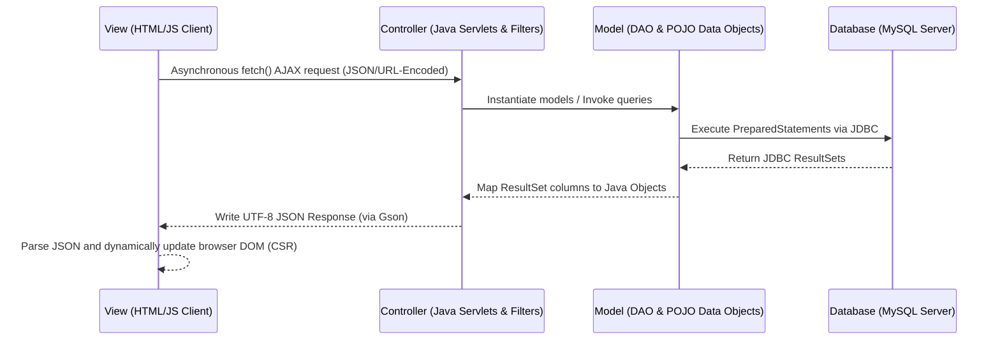
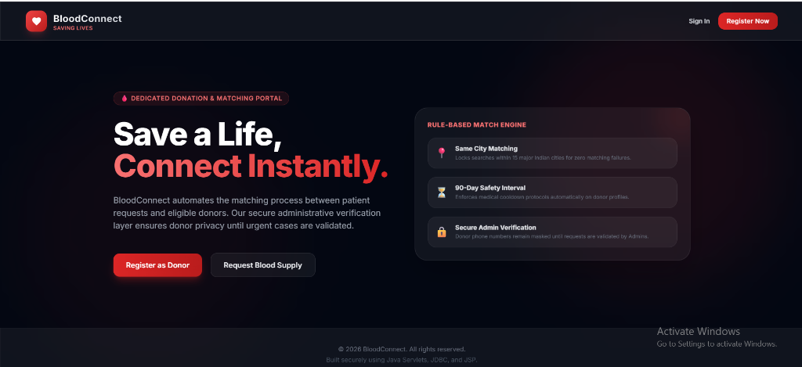
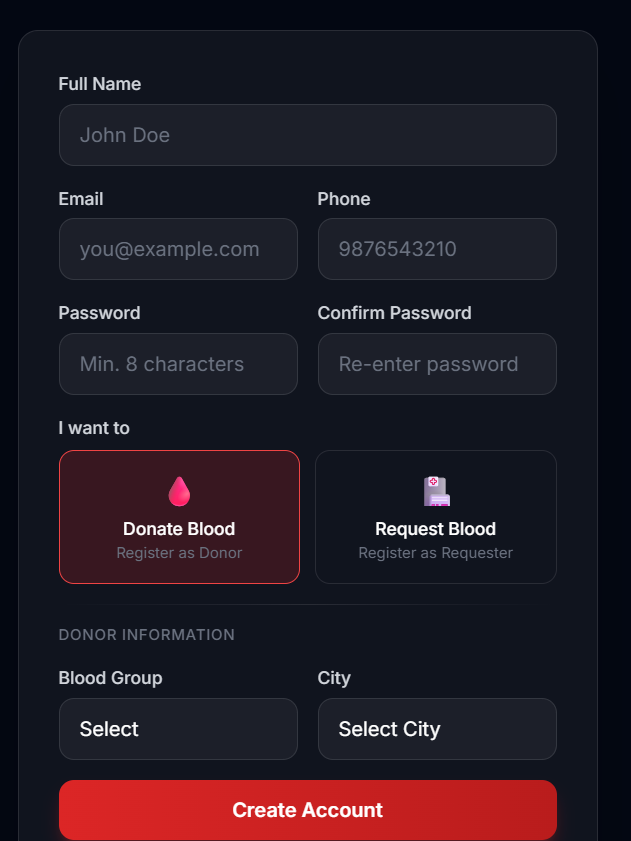
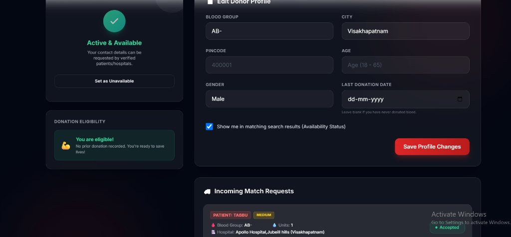
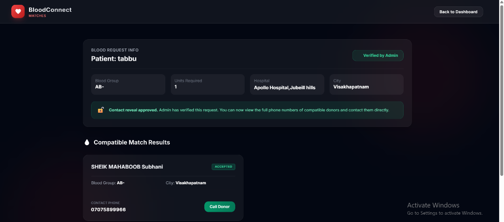
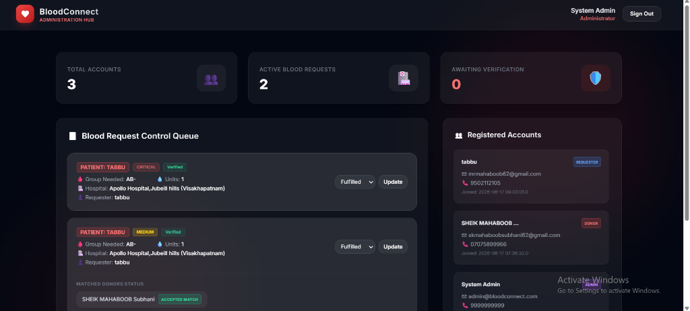

# BloodConnect — Donor & Request Matching System

BloodConnect is a web application built to connect patients/hospitals needing urgent blood with compatible, available donors nearby. The system manages donor profiles, availability cooling periods, blood requests, and verification routing, and hides contact information until verified by administrators.

---

## 1. Project Architecture: Decoupled Client-Side Rendered (CSR) MVC

BloodConnect follows a clean, decoupled **Model-View-Controller (MVC)** design pattern, optimized for modern Web API clients:



### Transitioning from Server-Side JSP to Client-Side Rendered (CSR) MVC
Traditional servlet applications render views on the server using Java Server Pages (JSP). When a user navigates or submits a form, the entire page reloads. In BloodConnect:
*   **The View is decoupled**: Legacy `.jsp` pages have been replaced by static `.html` files containing Vanilla JavaScript and Tailwind CSS.
*   **API-Centric Controllers**: The Servlets act as REST controllers. Instead of forwarding requests to a JSP file, they process data and stream back structured JSON payloads using Google `Gson`.
*   **Client-Side Rendering (CSR)**: The browser downloads the static files once. JavaScript manages user actions asynchronously via the `fetch()` API and updates individual DOM nodes without reloading the entire page. This reduces server CPU cycles, lowers bandwidth usage, and provides a sleek single-page app (SPA) experience.

---

## Application Screenshots

### 1. Landing Homepage
Beautiful dark-themed landing page built using Tailwind CSS glassmorphic cards and features.


### 2. Registration Page
Enables registering as a Requester or Donor, dynamically prompting location and availability settings.


### 3. Donor Dashboard
Allows donors to manage their personal profile, update availability, and review matched request queues.


### 4. Compatible Match Results
Displays match results with donor availability status. Phone numbers are fully revealed when the request is verified by an admin.


### 5. Admin Administration Hub
Displays user/request statistics, request queue controls, and status update actions with matched donor response tracking.



## 2. Directory and File Structure

Below is the directory tree of BloodConnect, followed by a detailed description of every file and folder:

```text
servletproject/
├───.settings/                          # IDE configuration files
├───Dockerfile                          # Docker container image build descriptor
├───entrypoint.sh                       # Container initialization shell script
├───pom.xml                             # Maven project dependencies and build manager
├───README.md                           # Tech documentation and interview guide
├───bloodconnect_prd_and_blueprint.md   # AI implementation blueprints and PRD
├───schema.sql                          # MySQL Database DDL creation queries
│
└───src/
    └───main/
        ├───java/
        │   └───com/
        │       └───bloodconnect/
        │           ├───controller/     # CONTROLLERS: Servlets handling HTTP JSON endpoints
        │           │       AdminDashboardServlet.java
        │           │       AdminVerifyServlet.java
        │           │       DonorProfileServlet.java
        │           │       LoginServlet.java
        │           │       LogoutServlet.java
        │           │       MatchServlet.java
        │           │       RegisterServlet.java
        │           │       RequestListServlet.java
        │           │       RequestServlet.java
        │           │
        │           ├───dao/            # MODELS (Data Access Objects): MySQL SQL execution
        │           │       DonorDAO.java
        │           │       MatchDAO.java
        │           │       RequestDAO.java
        │           │       UserDAO.java
        │           │
        │           ├───filter/         # SECURITY & SESSION MIDDLEWARE: Filters incoming requests
        │           │       AuthFilter.java
        │           │
        │           ├───model/          # MODELS (POJOs): Plain Old Java Objects mapped to schema
        │           │       BloodRequest.java
        │           │       DonorMatch.java
        │           │       DonorProfile.java
        │           │       User.java
        │           │
        │           └───util/           # UTILITIES: Configurations and Helper classes
        │                   CityList.java
        │                   DatabaseInitializer.java
        │                   DBConnection.java
        │                   PasswordUtil.java
        │
        └───webapp/                     # VIEWS: HTML UI screens and Client Scripts
            │   admin-dashboard.html
            │   donor-dashboard.html
            │   error.html
            │   index.html
            │   login.html
            │   match-results.html
            │   register.html
            │   request-form.html
            │   requester-dashboard.html
            │
            └───WEB-INF/
                    schema.sql          # Secondary reference copy of DB schema DDL
                    web.xml             # Tomcat web application descriptor
```

### Backend Java Files (com.bloodconnect)
*   **`controller/` (Controllers)**:
    *   [LoginServlet.java](file:///c:/Users/Lenovo/Desktop/servletproject/src/main/java/com/bloodconnect/controller/LoginServlet.java): Manages user login queries and checks active HTTP sessions.
    *   [LogoutServlet.java](file:///c:/Users/Lenovo/Desktop/servletproject/src/main/java/com/bloodconnect/controller/LogoutServlet.java): Invalidates active Tomcat sessions. Supports both HTTP GET and POST.
    *   [RegisterServlet.java](file:///c:/Users/Lenovo/Desktop/servletproject/src/main/java/com/bloodconnect/controller/RegisterServlet.java): Creates user accounts and hashes passwords.
    *   [DonorProfileServlet.java](file:///c:/Users/Lenovo/Desktop/servletproject/src/main/java/com/bloodconnect/controller/DonorProfileServlet.java): Updates and fetches a donor's profile fields, availability toggles, and compatible matches.
    *   [RequestServlet.java](file:///c:/Users/Lenovo/Desktop/servletproject/src/main/java/com/bloodconnect/controller/RequestServlet.java): Creates blood requests and triggers the automated matching engine.
    *   [RequestListServlet.java](file:///c:/Users/Lenovo/Desktop/servletproject/src/main/java/com/bloodconnect/controller/RequestListServlet.java): Fetches requests submitted by a specific requester user.
    *   [MatchServlet.java](file:///c:/Users/Lenovo/Desktop/servletproject/src/main/java/com/bloodconnect/controller/MatchServlet.java): Returns matching donors. Masks phone numbers if the admin has not verified the request.
    *   [AdminDashboardServlet.java](file:///c:/Users/Lenovo/Desktop/servletproject/src/main/java/com/bloodconnect/controller/AdminDashboardServlet.java): Aggregates user counts, request lists, and database stats for the admin.
    *   [AdminVerifyServlet.java](file:///c:/Users/Lenovo/Desktop/servletproject/src/main/java/com/bloodconnect/controller/AdminVerifyServlet.java): Handles request verifications and status changes made by admins.
*   **`dao/` (Models - Data Access)**:
    *   [UserDAO.java](file:///c:/Users/Lenovo/Desktop/servletproject/src/main/java/com/bloodconnect/dao/UserDAO.java): Performs SQL queries on the `users` table.
    *   [DonorDAO.java](file:///c:/Users/Lenovo/Desktop/servletproject/src/main/java/com/bloodconnect/dao/DonorDAO.java): Performs SQL queries on `donor_profiles`. Includes the matching query.
    *   [RequestDAO.java](file:///c:/Users/Lenovo/Desktop/servletproject/src/main/java/com/bloodconnect/dao/RequestDAO.java): Performs SQL queries on `blood_requests`.
    *   [MatchDAO.java](file:///c:/Users/Lenovo/Desktop/servletproject/src/main/java/com/bloodconnect/dao/MatchDAO.java): Performs SQL queries on `donor_matches` to record and update donor responses.
*   **`filter/` (Middleware)**:
    *   [AuthFilter.java](file:///c:/Users/Lenovo/Desktop/servletproject/src/main/java/com/bloodconnect/filter/AuthFilter.java): Standard Servlet Filter intercepting requests to enforce authentication checks and role checks.
*   **`model/` (Models - POJOs)**:
    *   [User.java](file:///c:/Users/Lenovo/Desktop/servletproject/src/main/java/com/bloodconnect/model/User.java): Entity class mapping users.
    *   [DonorProfile.java](file:///c:/Users/Lenovo/Desktop/servletproject/src/main/java/com/bloodconnect/model/DonorProfile.java): Entity class mapping donor parameters.
    *   [BloodRequest.java](file:///c:/Users/Lenovo/Desktop/servletproject/src/main/java/com/bloodconnect/model/BloodRequest.java): Entity class mapping blood requests.
    *   [DonorMatch.java](file:///c:/Users/Lenovo/Desktop/servletproject/src/main/java/com/bloodconnect/model/DonorMatch.java): Entity class mapping donor-request links.
*   **`util/` (Utilities)**:
    *   [CityList.java](file:///c:/Users/Lenovo/Desktop/servletproject/src/main/java/com/bloodconnect/util/CityList.java): Returns standard city dropdown options.
    *   [DBConnection.java](file:///c:/Users/Lenovo/Desktop/servletproject/src/main/java/com/bloodconnect/util/DBConnection.java): Dynamic MySQL connection manager with cloud-to-local fallback mechanisms.
    *   [DatabaseInitializer.java](file:///c:/Users/Lenovo/Desktop/servletproject/src/main/java/com/bloodconnect/util/DatabaseInitializer.java): Listens for server startup. Automatically reads `schema.sql` to build tables if missing.
    *   [PasswordUtil.java](file:///c:/Users/Lenovo/Desktop/servletproject/src/main/java/com/bloodconnect/util/PasswordUtil.java): Hashes and verifies passwords using BCrypt.

### Frontend webapp Files (Views)
*   [index.html](file:///c:/Users/Lenovo/Desktop/servletproject/src/main/webapp/index.html): Dark-mode landing homepage.
*   [login.html](file:///c:/Users/Lenovo/Desktop/servletproject/src/main/webapp/login.html): Centered credentials card that submits data via AJAX.
*   [register.html](file:///c:/Users/Lenovo/Desktop/servletproject/src/main/webapp/register.html): Multi-role registration screen with dynamic location fields.
*   [donor-dashboard.html](file:///c:/Users/Lenovo/Desktop/servletproject/src/main/webapp/donor-dashboard.html): Portal for donors to edit details, toggle availability, and respond to match request queues.
*   [requester-dashboard.html](file:///c:/Users/Lenovo/Desktop/servletproject/src/main/webapp/requester-dashboard.html): Portal for requesters to track their submitted requests and see matching counts.
*   [request-form.html](file:///c:/Users/Lenovo/Desktop/servletproject/src/main/webapp/request-form.html): Input interface to submit a new urgent blood request.
*   [match-results.html](file:///c:/Users/Lenovo/Desktop/servletproject/src/main/webapp/match-results.html): Dynamic list of matching donors. Hides phone numbers unless the admin has verified the request.
*   [admin-dashboard.html](file:///c:/Users/Lenovo/Desktop/servletproject/src/main/webapp/admin-dashboard.html): Management workspace showing users lists, database metrics, and request verification controls.
*   [error.html](file:///c:/Users/Lenovo/Desktop/servletproject/src/main/webapp/error.html): Fallback redirection page for HTTP 404/500 errors.

---

## 3. How JavaScript API Calls Connect to Java Servlets

In this application, front-end JavaScript communicates asynchronously with backend Servlets using standard Web APIs.

```text
  [Client Browser]                                      [Tomcat Servlet Container]
  HTML/JS UI Pages                                         Java Servlet class
         │                                                         │
         │  1) fetch('/donor/profile', { method: 'POST',           │
         │           body: URLSearchParams("action=toggle") })     │
         ├────────────────────────────────────────────────────────>│  2) read parameter:
         │                                                         │     request.getParameter("action")
         │                                                         │  3) execute database operations
         │                                                         │  4) write JSON data stream:
         │  5) response.json() => parse Javascript object          │     response.getWriter().write(...)
         │<────────────────────────────────────────────────────────┤
         v                                                         v
```

1.  **Request Construction**: The client uses `fetch()` to hit a URL route. Parameters are serialized using `URLSearchParams` to format data as `application/x-www-form-urlencoded`.
2.  **Request Handling**: The Java Servlet interceptor receives the request. The servlet parses incoming arguments via `request.getParameter()`.
3.  **JSON Response Generation**: The Servlet sets the response headers to `application/json;charset=UTF-8`, serializes the Java objects/maps using `Gson`, and writes the JSON string to the response writer stream.
4.  **DOM Rendering**: The JavaScript parses the JSON promise and dynamically updates target HTML element IDs.

---

## 4. How the Database Connection & Fallback Work

To ensure seamless execution across local development machines and cloud deployment services (like Railway), the DB connection factory is automated:

1.  **Read Environment Variables**: It first checks for cloud environment variables injects by PaaS platforms (`MYSQLHOST`, `MYSQLPORT`, `MYSQLDATABASE`, `MYSQLUSER`, `MYSQLPASSWORD`).
2.  **JDBC Driver Loading**: The driver class `com.mysql.cj.jdbc.Driver` is initialized in a static initializer block.
3.  **Database Connection Attempt**: It constructs a connection string and attempts to connect.
4.  **Local Fallback Catch**: If the connection attempt fails or throws a `SQLException` (e.g., cloud database has offline limits or variables are missing), the factory catches the exception, checks if the host was set to a remote server, and automatically attempts to establish a connection to `localhost:3306` with default credentials (`root` and empty password).

---

## 5. Tailwind CSS Integration

Tailwind CSS is added to every frontend screen to design a premium dark-mode glassmorphic visual style:
*   **CDN Integration**: Embedded inside `<head>` via `<script src="https://cdn.tailwindcss.com"></script>`.
*   **Theme Extension Config**:
    ```javascript
    tailwind.config = {
        theme: {
            extend: {
                fontFamily: { sans: ['Inter', 'sans-serif'] },
                colors: {
                    blood: {
                        50: '#fef2f2', 100: '#fee2e2', 200: '#fecaca',
                        300: '#fca5a5', 400: '#f87171', 500: '#ef4444',
                        600: '#dc2626', 700: '#b91c1c', 800: '#991b1b',
                        900: '#7f1d1d', 950: '#450a0a'
                    }
                }
            }
        }
    }
    ```
*   **Glassmorphism CSS Overlay**:
    ```css
    .glass {
        background: rgba(255, 255, 255, 0.05);
        backdrop-filter: blur(20px);
        border: 1px solid rgba(255, 255, 255, 0.1);
    }
    ```

---

## 6. MySQL Database Schema & Table Reference

The application uses MySQL to persist users, donor availability, requests, and matches. Below is the detailed schema layout with data types, constraints, and optimization indexes:

### A. `users` Table
Stores basic account and authentication details for all users (Donors, Requesters, Admins).

| Column Name | Data Type | Nullable | Constraints / Default | Description |
| :--- | :--- | :--- | :--- | :--- |
| `user_id` | `INT` | No | `PRIMARY KEY AUTO_INCREMENT` | Unique identifier for the user account. |
| `full_name` | `VARCHAR(100)` | No | - | The user's complete name. |
| `email` | `VARCHAR(100)` | No | `UNIQUE` | User login credential; must be globally unique. |
| `password_hash` | `VARCHAR(255)` | No | - | BCrypt hashed password (10 rounds of salt). |
| `phone` | `VARCHAR(15)` | No | - | User's telephone number. |
| `role` | `ENUM('DONOR', 'REQUESTER', 'ADMIN')`| No | `DEFAULT 'DONOR'` | Role for authentication and dashboard routing. |
| `created_at` | `TIMESTAMP` | Yes | `DEFAULT CURRENT_TIMESTAMP` | System registration timestamp. |

### B. `donor_profiles` Table
Stores blood-specific metadata for users registered with the `DONOR` role.

| Column Name | Data Type | Nullable | Constraints / Default | Description |
| :--- | :--- | :--- | :--- | :--- |
| `donor_id` | `INT` | No | `PRIMARY KEY`, `FOREIGN KEY REFERENCES users(user_id) ON DELETE CASCADE` | Associates profile with corresponding user record. |
| `blood_group` | `ENUM('A+', 'A-', 'B+', 'B-', 'AB+', 'AB-', 'O+', 'O-')` | No | - | Donor's blood type. |
| `age` | `INT` | Yes | - | Age of donor. Checked client-side (>18 and <65). |
| `gender` | `ENUM('M', 'F', 'OTHER')`| Yes | - | Gender identification. |
| `city` | `VARCHAR(50)` | No | - | City of residence (used for local matching). |
| `pincode` | `VARCHAR(10)` | Yes | - | Area postal code. |
| `last_donation_date`| `DATE` | Yes | `NULL` | Date of last donation. Used for 90-day cooling gap. |
| `is_available` | `BOOLEAN` | Yes | `DEFAULT TRUE` | Temporary availability toggle controlled by donor. |

**Indexes on `donor_profiles`:**
*   `idx_donor_blood_group` ON `blood_group` — Optimizes exact matches in matching query.
*   `idx_donor_city` ON `city` — Speeds up regional search.
*   `idx_donor_available` ON `is_available` — Filters out inactive donors quickly.

### C. `blood_requests` Table
Tracks patient requests for blood units filed by requesters.

| Column Name | Data Type | Nullable | Constraints / Default | Description |
| :--- | :--- | :--- | :--- | :--- |
| `request_id` | `INT` | No | `PRIMARY KEY AUTO_INCREMENT` | Unique ID for the blood request. |
| `requester_id` | `INT` | No | `FOREIGN KEY REFERENCES users(user_id) ON DELETE CASCADE` | The user (`REQUESTER` role) who filed the request. |
| `patient_name` | `VARCHAR(100)` | Yes | - | Patient's name. |
| `blood_group_needed`| `ENUM('A+', 'A-', 'B+', 'B-', 'AB+', 'AB-', 'O+', 'O-')` | No | - | Required blood type. |
| `units_required` | `INT` | No | `DEFAULT 1` | Quantity of blood units requested. |
| `hospital_name` | `VARCHAR(100)` | No | - | Location where blood is required. |
| `city` | `VARCHAR(50)` | No | - | City of hospital. |
| `urgency` | `ENUM('LOW', 'MEDIUM', 'HIGH', 'CRITICAL')`| Yes | `DEFAULT 'MEDIUM'` | Priority weight of request. |
| `status` | `ENUM('OPEN', 'MATCHED', 'FULFILLED', 'CLOSED')`| Yes | `DEFAULT 'OPEN'` | Lifecycle state of the request. |
| `is_verified` | `BOOLEAN` | Yes | `DEFAULT FALSE` | Set to TRUE by admin to allow contact detail view. |
| `verified_by` | `INT` | Yes | `FOREIGN KEY REFERENCES users(user_id) ON DELETE SET NULL` | Reference to the admin user who approved it. |
| `created_at` | `TIMESTAMP` | Yes | `DEFAULT CURRENT_TIMESTAMP` | Date and time request was filed. |

**Indexes on `blood_requests`:**
*   `idx_request_status` ON `status` — Optimizes matching dashboard filtering.
*   `idx_request_verified` ON `is_verified` — Optimizes admin approval queue queries.

### D. `donor_matches` Table
Acts as a join table linking requests to eligible matching donors.

| Column Name | Data Type | Nullable | Constraints / Default | Description |
| :--- | :--- | :--- | :--- | :--- |
| `match_id` | `INT` | No | `PRIMARY KEY AUTO_INCREMENT` | Unique matching key. |
| `request_id` | `INT` | No | `FOREIGN KEY REFERENCES blood_requests(request_id) ON DELETE CASCADE` | The active request. |
| `donor_id` | `INT` | No | `FOREIGN KEY REFERENCES users(user_id) ON DELETE CASCADE` | The matched donor. |
| `status` | `ENUM('PENDING', 'ACCEPTED', 'DECLINED')`| Yes | `DEFAULT 'PENDING'` | Current response status from the donor. |
| `matched_at` | `TIMESTAMP` | Yes | `DEFAULT CURRENT_TIMESTAMP` | When the match was created. |

**Constraints & Indexes on `donor_matches`:**
*   `UNIQUE KEY unique_request_donor (request_id, donor_id)` — Enforces that a donor is matched at most once per request.
*   `idx_match_request` ON `request_id` — Speeds up retrieval of matched donors for a request.
*   `idx_match_donor` ON `donor_id` — Speeds up lookup of incoming matches for a donor's dashboard.

---

## 7. Catalog of MySQL JDBC Queries in the Codebase

All database interactions in BloodConnect are executed using `java.sql.PreparedStatement` to ensure type-safe parameters, prevent SQL injection, and allow the database server to pre-compile the execution plans.

### A. User Management Queries (`UserDAO.java`)

1.  **Register a New User**
    *   **SQL Statement**:
        ```sql
        INSERT INTO users (full_name, email, password_hash, phone, role) VALUES (?, ?, ?, ?, ?)
        ```
    *   **Java File & Method**: [UserDAO.java](file:///d:/attendance_new/downloadschrome/servletproject_bloodmatching/blooadmatching_servlet/src/main/java/com/bloodconnect/dao/UserDAO.java) -> `public int register(User user)`
    *   **Parameters**: `full_name` (String), `email` (String), `password_hash` (String), `phone` (String), `role` (String)
    *   **Return Value**: `int` (generated `user_id` primary key, or `-1` on failure)

2.  **Find User by Email**
    *   **SQL Statement**:
        ```sql
        SELECT * FROM users WHERE email = ?
        ```
    *   **Java File & Method**: [UserDAO.java](file:///d:/attendance_new/downloadschrome/servletproject_bloodmatching/blooadmatching_servlet/src/main/java/com/bloodconnect/dao/UserDAO.java) -> `public User findByEmail(String email)`
    *   **Parameters**: `email` (String)
    *   **Return Value**: `User` object (or `null` if not found)

3.  **Find User by ID**
    *   **SQL Statement**:
        ```sql
        SELECT * FROM users WHERE user_id = ?
        ```
    *   **Java File & Method**: [UserDAO.java](file:///d:/attendance_new/downloadschrome/servletproject_bloodmatching/blooadmatching_servlet/src/main/java/com/bloodconnect/dao/UserDAO.java) -> `public User findById(int userId)`
    *   **Parameters**: `user_id` (int)
    *   **Return Value**: `User` object (or `null` if not found)

4.  **List All Registered Users**
    *   **SQL Statement**:
        ```sql
        SELECT * FROM users ORDER BY created_at DESC
        ```
    *   **Java File & Method**: [UserDAO.java](file:///d:/attendance_new/downloadschrome/servletproject_bloodmatching/blooadmatching_servlet/src/main/java/com/bloodconnect/dao/UserDAO.java) -> `public List<User> getAllUsers()`
    *   **Parameters**: None
    *   **Return Value**: `List<User>`

---

### B. Donor Profile Queries (`DonorDAO.java`)

1.  **Create Donor Profile**
    *   **SQL Statement**:
        ```sql
        INSERT INTO donor_profiles (donor_id, blood_group, age, gender, city, pincode, last_donation_date, is_available) VALUES (?, ?, ?, ?, ?, ?, ?, ?)
        ```
    *   **Java File & Method**: [DonorDAO.java](file:///d:/attendance_new/downloadschrome/servletproject_bloodmatching/blooadmatching_servlet/src/main/java/com/bloodconnect/dao/DonorDAO.java) -> `public void createProfile(DonorProfile dp)`
    *   **Parameters**: `donor_id` (int), `blood_group` (String), `age` (Integer/Null), `gender` (String), `city` (String), `pincode` (String), `last_donation_date` (Date/Null), `is_available` (boolean)
    *   **Return Value**: `void`

2.  **Retrieve Donor Profile**
    *   **SQL Statement**:
        ```sql
        SELECT * FROM donor_profiles WHERE donor_id = ?
        ```
    *   **Java File & Method**: [DonorDAO.java](file:///d:/attendance_new/downloadschrome/servletproject_bloodmatching/blooadmatching_servlet/src/main/java/com/bloodconnect/dao/DonorDAO.java) -> `public DonorProfile getProfile(int donorId)`
    *   **Parameters**: `donor_id` (int)
    *   **Return Value**: `DonorProfile` object (or `null` if not found)

3.  **Update Donor Profile**
    *   **SQL Statement**:
        ```sql
        UPDATE donor_profiles SET blood_group = ?, age = ?, gender = ?, city = ?, pincode = ?, last_donation_date = ?, is_available = ? WHERE donor_id = ?
        ```
    *   **Java File & Method**: [DonorDAO.java](file:///d:/attendance_new/downloadschrome/servletproject_bloodmatching/blooadmatching_servlet/src/main/java/com/bloodconnect/dao/DonorDAO.java) -> `public void updateProfile(DonorProfile dp)`
    *   **Parameters**: `blood_group` (String), `age` (Integer/Null), `gender` (String), `city` (String), `pincode` (String), `last_donation_date` (Date/Null), `is_available` (boolean), `donor_id` (int)
    *   **Return Value**: `void`

4.  **Toggle Availability Status**
    *   **SQL Statement**:
        ```sql
        UPDATE donor_profiles SET is_available = ? WHERE donor_id = ?
        ```
    *   **Java File & Method**: [DonorDAO.java](file:///d:/attendance_new/downloadschrome/servletproject_bloodmatching/blooadmatching_servlet/src/main/java/com/bloodconnect/dao/DonorDAO.java) -> `public void toggleAvailability(int donorId, boolean available)`
    *   **Parameters**: `is_available` (boolean), `donor_id` (int)
    *   **Return Value**: `void`

5.  **Get All Donor Profiles**
    *   **SQL Statement**:
        ```sql
        SELECT * FROM donor_profiles
        ```
    *   **Java File & Method**: [DonorDAO.java](file:///d:/attendance_new/downloadschrome/servletproject_bloodmatching/blooadmatching_servlet/src/main/java/com/bloodconnect/dao/DonorDAO.java) -> `public List<DonorProfile> getAllDonors()`
    *   **Parameters**: None
    *   **Return Value**: `List<DonorProfile>`

---

### C. Blood Request Queries (`RequestDAO.java`)

1.  **Create Blood Request**
    *   **SQL Statement**:
        ```sql
        INSERT INTO blood_requests (requester_id, patient_name, blood_group_needed, units_required, hospital_name, city, urgency) VALUES (?, ?, ?, ?, ?, ?, ?)
        ```
    *   **Java File & Method**: [RequestDAO.java](file:///d:/attendance_new/downloadschrome/servletproject_bloodmatching/blooadmatching_servlet/src/main/java/com/bloodconnect/dao/RequestDAO.java) -> `public int createRequest(BloodRequest req)`
    *   **Parameters**: `requester_id` (int), `patient_name` (String), `blood_group_needed` (String), `units_required` (int), `hospital_name` (String), `city` (String), `urgency` (String)
    *   **Return Value**: `int` (generated `request_id` or `-1` on failure)

2.  **Fetch Request by ID**
    *   **SQL Statement**:
        ```sql
        SELECT br.*, u.full_name AS requester_name FROM blood_requests br JOIN users u ON br.requester_id = u.user_id WHERE br.request_id = ?
        ```
    *   **Java File & Method**: [RequestDAO.java](file:///d:/attendance_new/downloadschrome/servletproject_bloodmatching/blooadmatching_servlet/src/main/java/com/bloodconnect/dao/RequestDAO.java) -> `public BloodRequest getRequestById(int requestId)`
    *   **Parameters**: `request_id` (int)
    *   **Return Value**: `BloodRequest` object (or `null` if not found)

3.  **Fetch Requests Submitted by Specific Requester**
    *   **SQL Statement**:
        ```sql
        SELECT br.*, u.full_name AS requester_name FROM blood_requests br JOIN users u ON br.requester_id = u.user_id WHERE br.requester_id = ? ORDER BY br.created_at DESC
        ```
    *   **Java File & Method**: [RequestDAO.java](file:///d:/attendance_new/downloadschrome/servletproject_bloodmatching/blooadmatching_servlet/src/main/java/com/bloodconnect/dao/RequestDAO.java) -> `public List<BloodRequest> getRequestsByRequester(int requesterId)`
    *   **Parameters**: `requester_id` (int)
    *   **Return Value**: `List<BloodRequest>`

4.  **Fetch All Requests Sorted by Urgency and Date (Admin Dashboard)**
    *   **SQL Statement**:
        ```sql
        SELECT br.*, u.full_name AS requester_name FROM blood_requests br JOIN users u ON br.requester_id = u.user_id ORDER BY FIELD(br.urgency, 'CRITICAL', 'HIGH', 'MEDIUM', 'LOW'), br.created_at DESC
        ```
    *   **Java File & Method**: [RequestDAO.java](file:///d:/attendance_new/downloadschrome/servletproject_bloodmatching/blooadmatching_servlet/src/main/java/com/bloodconnect/dao/RequestDAO.java) -> `public List<BloodRequest> getAllRequests()`
    *   **Parameters**: None
    *   **Return Value**: `List<BloodRequest>`

5.  **Fetch Unverified Blood Requests (Admin Approval Queue)**
    *   **SQL Statement**:
        ```sql
        SELECT br.*, u.full_name AS requester_name FROM blood_requests br JOIN users u ON br.requester_id = u.user_id WHERE br.is_verified = FALSE AND br.status != 'CLOSED' ORDER BY FIELD(br.urgency, 'CRITICAL', 'HIGH', 'MEDIUM', 'LOW'), br.created_at ASC
        ```
    *   **Java File & Method**: [RequestDAO.java](file:///d:/attendance_new/downloadschrome/servletproject_bloodmatching/blooadmatching_servlet/src/main/java/com/bloodconnect/dao/RequestDAO.java) -> `public List<BloodRequest> getPendingVerifications()`
    *   **Parameters**: None
    *   **Return Value**: `List<BloodRequest>`

6.  **Verify and Approve Blood Request**
    *   **SQL Statement**:
        ```sql
        UPDATE blood_requests SET is_verified = TRUE, verified_by = ? WHERE request_id = ?
        ```
    *   **Java File & Method**: [RequestDAO.java](file:///d:/attendance_new/downloadschrome/servletproject_bloodmatching/blooadmatching_servlet/src/main/java/com/bloodconnect/dao/RequestDAO.java) -> `public void verifyRequest(int requestId, int adminId)`
    *   **Parameters**: `verified_by` (admin's user_id - int), `request_id` (int)
    *   **Return Value**: `void`

7.  **Update Request Status**
    *   **SQL Statement**:
        ```sql
        UPDATE blood_requests SET status = ? WHERE request_id = ?
        ```
    *   **Java File & Method**: [RequestDAO.java](file:///d:/attendance_new/downloadschrome/servletproject_bloodmatching/blooadmatching_servlet/src/main/java/com/bloodconnect/dao/RequestDAO.java) -> `public void updateStatus(int requestId, String status)`
    *   **Parameters**: `status` (String - OPEN/MATCHED/FULFILLED/CLOSED), `request_id` (int)
    *   **Return Value**: `void`

---

### D. Donor Matching & Tracking Queries (`MatchDAO.java`)

1.  **Create Match Record**
    *   **SQL Statement**:
        ```sql
        INSERT INTO donor_matches (request_id, donor_id) VALUES (?, ?)
        ```
    *   **Java File & Method**: [MatchDAO.java](file:///d:/attendance_new/downloadschrome/servletproject_bloodmatching/blooadmatching_servlet/src/main/java/com/bloodconnect/dao/MatchDAO.java) -> `public int createMatch(int requestId, int donorId)`
    *   **Parameters**: `request_id` (int), `donor_id` (int)
    *   **Return Value**: `int` (generated `match_id` or `-1` on failure)

2.  **Fetch Matches for a Blood Request (with Donor details via JOINs)**
    *   **SQL Statement**:
        ```sql
        SELECT dm.*, u.full_name AS donor_name, u.phone AS donor_phone, d.blood_group AS donor_blood_group, d.city AS donor_city 
        FROM donor_matches dm 
        JOIN users u ON dm.donor_id = u.user_id 
        JOIN donor_profiles d ON dm.donor_id = d.donor_id 
        WHERE dm.request_id = ? 
        ORDER BY dm.matched_at DESC
        ```
    *   **Java File & Method**: [MatchDAO.java](file:///d:/attendance_new/downloadschrome/servletproject_bloodmatching/blooadmatching_servlet/src/main/java/com/bloodconnect/dao/MatchDAO.java) -> `public List<DonorMatch> getMatchesByRequest(int requestId)`
    *   **Parameters**: `request_id` (int)
    *   **Return Value**: `List<DonorMatch>`

3.  **Fetch Matches assigned to a Donor (with Request details via JOINs)**
    *   **SQL Statement**:
        ```sql
        SELECT dm.*, u.full_name AS donor_name, u.phone AS donor_phone, d.blood_group AS donor_blood_group, d.city AS donor_city, 
               br.patient_name, br.blood_group_needed, br.units_required, br.hospital_name, br.city AS request_city, br.urgency 
        FROM donor_matches dm 
        JOIN users u ON dm.donor_id = u.user_id 
        JOIN donor_profiles d ON dm.donor_id = d.donor_id 
        JOIN blood_requests br ON dm.request_id = br.request_id 
        WHERE dm.donor_id = ? 
        ORDER BY dm.matched_at DESC
        ```
    *   **Java File & Method**: [MatchDAO.java](file:///d:/attendance_new/downloadschrome/servletproject_bloodmatching/blooadmatching_servlet/src/main/java/com/bloodconnect/dao/MatchDAO.java) -> `public List<DonorMatch> getMatchesByDonor(int donorId)`
    *   **Parameters**: `donor_id` (int)
    *   **Return Value**: `List<DonorMatch>`

4.  **Update Donor's Response Status (Accept / Decline)**
    *   **SQL Statement**:
        ```sql
        UPDATE donor_matches SET status = ? WHERE match_id = ?
        ```
    *   **Java File & Method**: [MatchDAO.java](file:///d:/attendance_new/downloadschrome/servletproject_bloodmatching/blooadmatching_servlet/src/main/java/com/bloodconnect/dao/MatchDAO.java) -> `public void updateMatchStatus(int matchId, String status)`
    *   **Parameters**: `status` (String - ACCEPTED/DECLINED), `match_id` (int)
    *   **Return Value**: `void`

5.  **Check If Match Already Exists (Prevent Duplicates)**
    *   **SQL Statement**:
        ```sql
        SELECT COUNT(*) FROM donor_matches WHERE request_id = ? AND donor_id = ?
        ```
    *   **Java File & Method**: [MatchDAO.java](file:///d:/attendance_new/downloadschrome/servletproject_bloodmatching/blooadmatching_servlet/src/main/java/com/bloodconnect/dao/MatchDAO.java) -> `public boolean matchExists(int requestId, int donorId)`
    *   **Parameters**: `request_id` (int), `donor_id` (int)
    *   **Return Value**: `boolean` (`true` if count > 0, `false` otherwise)

---

## 8. Patient-Donor Matching Engine & Query Analysis

The automated matching logic runs whenever a new blood request is created. The algorithm isolates suitable, healthy, and geographical matches by performing a JOIN between `donor_profiles` and `users`.

### The Core Matching Query (`DonorDAO.java`)
```sql
SELECT d.*, u.full_name, u.phone 
FROM donor_profiles d 
JOIN users u ON d.donor_id = u.user_id 
WHERE d.blood_group = ? 
  AND LOWER(d.city) = LOWER(?) 
  AND d.is_available = TRUE 
  AND (d.last_donation_date IS NULL OR DATEDIFF(CURDATE(), d.last_donation_date) > 90)
```

### Detailed Logical Breakdown:

1.  **Table Join (`JOIN users u ON d.donor_id = u.user_id`)**:
    *   `donor_profiles` (`d`) holds clinical and availability metadata (blood group, availability, last donation date).
    *   `users` (`u`) holds contact details (full name, phone number).
    *   Joining them allows the system to populate matching lists with contact details ready to be mapped in Java.

2.  **Blood Compatibility Matching (`d.blood_group = ?`)**:
    *   Restricts matches strictly to the exact blood type required by the patient (e.g., `O+` requests only match `O+` profiles).

3.  **Regional Filter (`LOWER(d.city) = LOWER(?)`)**:
    *   Enforces localized donation to ensure the donor can travel to the hospital quickly.
    *   The SQL `LOWER()` function wraps both columns to ensure case insensitivity (e.g., matching "Bangalore", "bangalore", and "BANGALORE" correctly).

4.  **Active Status Check (`d.is_available = TRUE`)**:
    *   Ensures that only donors who have their status toggled to active in their dashboard are queued. Users can turn this off to temporarily snooze matching.

5.  **90-day Cooldown/Safety Period (`d.last_donation_date IS NULL OR DATEDIFF(CURDATE(), d.last_donation_date) > 90`)**:
    *   Prevents donors from donating too frequently, complying with standard medical safety policies.
    *   `DATEDIFF(CURDATE(), d.last_donation_date)` calculates the number of days since the last recorded donation. If this is `> 90`, the donor is eligible.
    *   `last_donation_date IS NULL` accounts for new donors who have not logged any donation yet, marking them eligible immediately.

6.  **Performance Indexes**:
    *   Filters are evaluated rapidly because of Composite Index structures: `idx_donor_blood_group` and `idx_donor_city` index the primary search conditions.

---

## 9. Technical Interview Questions & Answers

### Q1: How do JavaScript `fetch()` API calls connect to the Java Servlets in this Client-Side Rendered (CSR) setup?
**Answer**: 
*   **On the Backend**: Java Servlets declare routing endpoints using annotations (e.g., `@WebServlet("/donor/profile")`). 
*   **On the Client**: JavaScript sends an asynchronous HTTP request using `fetch()`. Form inputs are serialized into request body strings using `URLSearchParams` (URL-encoded format) or passed as query parameters.
*   **Request Interception**: The Java servlet reads parameters using `request.getParameter()`, executes database interactions, serializes the response objects to JSON via `Gson`, and writes it to the response stream.

**Client-Side JS Code Snippet (`donor-dashboard.html`)**:
```javascript
const params = new URLSearchParams();
params.append('action', 'toggleAvailability');
params.append('isAvailable', 'true');

fetch('donor/profile', {
    method: 'POST',
    headers: { 'Content-Type': 'application/x-www-form-urlencoded' },
    body: params
})
.then(res => res.json())
.then(data => {
    if (data.success) {
        console.log("Response:", data.message);
    }
});
```

**Server-Side Java Servlet Code Snippet (`DonorProfileServlet.java`)**:
```java
@WebServlet("/donor/profile")
public class DonorProfileServlet extends HttpServlet {
    private final DonorDAO donorDAO = new DonorDAO();
    private final Gson gson = new Gson();

    protected void doPost(HttpServletRequest request, HttpServletResponse response) throws IOException {
        response.setContentType("application/json");
        response.setCharacterEncoding("UTF-8");

        String action = request.getParameter("action");
        if ("toggleAvailability".equals(action)) {
            boolean isAvailable = Boolean.parseBoolean(request.getParameter("isAvailable"));
            HttpSession session = request.getSession(false);
            int userId = (Integer) session.getAttribute("userId");
            
            try {
                donorDAO.toggleAvailability(userId, isAvailable);
                Map<String, Object> result = new HashMap<>();
                result.put("success", true);
                result.put("message", "Availability updated.");
                response.getWriter().write(gson.toJson(result));
            } catch (SQLException e) {
                response.setStatus(500);
                response.getWriter().write("{\"success\":false}");
            }
        }
    }
}
```

---

### Q2: Explain the cloud-to-local fallback implementation in `DBConnection.java`.
**Answer**: 
To make deployment seamless, the `DBConnection` utility first attempts to load connection variables from environment variables (e.g. `MYSQLHOST`, `MYSQLPORT`, `MYSQLUSER`, `MYSQLPASSWORD`, `MYSQLDATABASE`), which are automatically injected by cloud platforms like Railway. If a `SQLException` occurs, the connection catcher recognizes the failure and automatically falls back to `localhost:3306` with default credentials (`root` and empty password).

```java
public static Connection getConnection() throws SQLException {
    String host = env("MYSQLHOST", "localhost");
    String port = env("MYSQLPORT", "3306");
    String db   = env("MYSQLDATABASE", "bloodconnect");
    String user = env("MYSQLUSER", "root");
    String pass = env("MYSQLPASSWORD", "");

    String url = "jdbc:mysql://" + host + ":" + port + "/" + db
               + "?useSSL=false&allowPublicKeyRetrieval=true&serverTimezone=UTC";

    try {
        return DriverManager.getConnection(url, user, pass);
    } catch (SQLException e) {
        if (!"localhost".equals(host)) {
            System.out.println("[DBConnection] Cloud connection failed. Falling back to local...");
            String localUrl = "jdbc:mysql://localhost:3306/bloodconnect"
                            + "?useSSL=false&allowPublicKeyRetrieval=true&serverTimezone=UTC";
            try {
                return DriverManager.getConnection(localUrl, "root", "");
            } catch (SQLException ex) {
                throw e; // throw original cloud exception if local fallback also fails
            }
        } else {
            throw e;
        }
    }
}
```

---

### Q3: How does the Automated Matching Engine select eligible donors and calculate the 90-day cooldown period?
**Answer**: 
The database checks eligibility using the MySQL `DATEDIFF()` function. The matching engine queries the `donor_profiles` table, filtering for matching blood groups, matching cities, availability toggles set to `TRUE`, and checking that the difference in days between the current date (`CURDATE()`) and the donor's `last_donation_date` is greater than 90. If `last_donation_date` is `NULL` (meaning the donor has not donated before), they are automatically included as eligible.

```sql
SELECT d.*, u.full_name, u.phone FROM donor_profiles d 
JOIN users u ON d.donor_id = u.user_id 
WHERE d.blood_group = ? 
  AND LOWER(d.city) = LOWER(?) 
  AND d.is_available = TRUE 
  AND (d.last_donation_date IS NULL OR DATEDIFF(CURDATE(), d.last_donation_date) > 90)
```

---

### Q4: How are passwords secured in the database?
**Answer**: 
Passwords are never stored in plain text. We use the **BCrypt** hashing algorithm inside [PasswordUtil.java](file:///d:/attendance_new/downloadschrome/servletproject_bloodmatching/blooadmatching_servlet/src/main/java/com/bloodconnect/util/PasswordUtil.java) to hash passwords before database insertion. BCrypt automatically generates a random salt and blends it with the password, rendering the hash secure against rainbow table lookups and brute-force attacks.

```java
package com.bloodconnect.util;
import org.mindrot.jbcrypt.BCrypt;

public class PasswordUtil {
    public static String hashPassword(String plainTextPassword) {
        return BCrypt.hashpw(plainTextPassword, BCrypt.gensalt(10));
    }
    public static boolean checkPassword(String plainTextPassword, String hashedPassword) {
        return BCrypt.checkpw(plainTextPassword, hashedPassword);
    }
}
```

---

### Q5: How does the application prevent SQL Injection?
**Answer**: 
We use **PreparedStatements** instead of concatenating inputs into raw SQL strings. When using `PreparedStatement`, the MySQL server compiles the SQL query structure beforehand. The inputs are then bound using placeholder indexes (`?`), treating inputs strictly as literal values rather than executable code instructions.

```java
String sql = "SELECT * FROM users WHERE email = ?";
try (Connection conn = DBConnection.getConnection();
     PreparedStatement ps = conn.prepareStatement(sql)) {
    ps.setString(1, email); // Safely bound as literal data
    try (ResultSet rs = ps.executeQuery()) {
        if (rs.next()) { ... }
    }
}
```

---

### Q6: How does the application protect against Cross-Site Scripting (XSS) in CSR?
**Answer**: 
In a Client-Side Rendered (CSR) application, XSS vulnerabilities can occur if user-submitted data from the database is inserted directly into the page using properties like `innerHTML`. To prevent this, we write dynamic text elements using **`textContent`** or standard text nodes. This forces the browser to treat the data strictly as plain text, escaping any HTML tags or JavaScript scripts.

```javascript
// SECURE: Browser escapes HTML tags automatically
const nameElement = document.createElement('span');
nameElement.textContent = donor.fullName; 

// INSECURE: vulnerable to XSS if donor.fullName contains <script>alert('xss')</script>
// element.innerHTML = donor.fullName; 
```

---

### Q7: Explain the role of `AuthFilter.java` and how it handles routing for both static page requests and AJAX REST API calls.
**Answer**: 
`AuthFilter.java` implements `javax.servlet.Filter` and intercepts all incoming requests via `@WebFilter("/*")`.
*   **Static Pages**: If an unauthenticated session requests a restricted view (e.g., `donor-dashboard.html`), the filter sends an HTTP redirect (`response.sendRedirect(...)`) to `/login.html`.
*   **REST APIs**: If the request is an AJAX API route (e.g. `/donor/profile`), redirecting would break the JavaScript call. The filter detects the API route and returns an HTTP `401 Unauthorized` status code with a JSON payload, allowing the client-side JavaScript to show a warning or route the user.

```java
HttpSession session = request.getSession(false);
if (session == null || session.getAttribute("userId") == null) {
    if (isApiRequest(path)) {
        response.setStatus(HttpServletResponse.SC_UNAUTHORIZED);
        response.setContentType("application/json");
        response.getWriter().write("{\"error\": \"Unauthorized. Please log in.\"}");
    } else {
        response.sendRedirect(request.getContextPath() + "/login.html");
    }
    return;
}
```

---

### Q8: How is the database schema initialized automatically on application startup without using CLI scripts?
**Answer**: 
We use the servlet container's **`ServletContextListener`** via `@WebListener` inside [DatabaseInitializer.java](file:///d:/attendance_new/downloadschrome/servletproject_bloodmatching/blooadmatching_servlet/src/main/java/com/bloodconnect/util/DatabaseInitializer.java). When Tomcat starts, the listener's `contextInitialized()` method runs. It checks if the `users` table exists. If the table is missing, it reads `/WEB-INF/schema.sql`, parses the SQL file statement-by-statement, and initializes the database tables and default admin account automatically.

```java
@WebListener
public class DatabaseInitializer implements ServletContextListener {
    @Override
    public void contextInitialized(ServletContextEvent sce) {
        try (Connection conn = DBConnection.getConnection()) {
            // Check table existence, read schema.sql, and execute statements
        } catch (SQLException e) {
            e.printStackTrace();
        }
    }
}
```

---

### Q9: How are donor phone numbers masked for privacy, and why must this masking happen server-side?
**Answer**: 
We mask donor contact details to protect privacy. If a requester views compatible donors for a request that has not yet been verified by an admin, the phone numbers are masked (e.g. `98******12`).
This masking must occur **server-side** inside [MatchServlet.java](file:///d:/attendance_new/downloadschrome/servletproject_bloodmatching/blooadmatching_servlet/src/main/java/com/bloodconnect/controller/MatchServlet.java) before the JSON response is sent. If we sent the raw numbers to the client and tried to mask them using CSS or client-side JavaScript, a user could easily inspect the network response in the browser console to reveal the unmasked numbers.

```java
List<DonorMatch> matches = matchDAO.getMatchesByRequest(requestId);
for (DonorMatch match : matches) {
    if (!bloodRequest.isVerified()) {
        String phone = match.getDonorPhone();
        if (phone != null && phone.length() >= 4) {
            match.setDonorPhone(phone.substring(0, 2) + "******" + phone.substring(phone.length() - 2));
        } else {
            match.setDonorPhone("********");
        }
    }
}
```

---

### Q10: Why do we use Google `Gson` in Java Servlets, and how is character encoding handled?
**Answer**: 
By default, Java Servlets do not have utility methods to convert Java objects into JSON strings. We use Google `Gson` to handle this serialization. To prevent special characters from breaking in transit, we explicitly set the response content type and character encoding to UTF-8 before writing data to the response buffer.

```java
response.setContentType("application/json");
response.setCharacterEncoding("UTF-8");

Map<String, Object> result = new HashMap<>();
result.put("success", true);
result.put("message", "Profile updated.");

response.getWriter().write(gson.toJson(result));
```

---

### Q11: Explain the difference between `getSession(true)` and `getSession(false)` as used in this application.
**Answer**: 
*   `request.getSession(true)`: Checks if a session already exists for the user. If not, it creates and returns a new session. This is used during **authentication** in `LoginServlet.java` to start a session after verifying credentials.
*   `request.getSession(false)`: Checks for an existing session. If no session exists, it returns `null` instead of creating one. This is used in **authorization filters** (`AuthFilter.java`) and status check routes (`GET /login`) to inspect session attributes without creating unnecessary session files in memory.

---

### Q12: How is role-based dashboard redirection managed when a user navigates to `/` (index.html)?
**Answer**: 
When the static landing page loads, a client-side JavaScript block runs and sends a request to `GET /login`. 
*   If the session is valid, the API returns the user's role (`DONOR`, `REQUESTER`, or `ADMIN`).
*   The JavaScript then updates the navigation bar, hiding the "Sign In" link and displaying a "Dashboard" link that routes to the appropriate dashboard page (e.g. `donor-dashboard.html`, `requester-dashboard.html`, or `admin-dashboard.html`).
*   If an unauthenticated user attempts to visit a dashboard directly, the `AuthFilter` intercepts the request and redirects them to the login page.

---

### Q13: How does the database design represent matching records, and how do we prevent duplicate entries?
**Answer**: 
Matches are stored in the `donor_matches` table, which acts as a join table linking `blood_requests` and `donor_profiles`. To prevent duplicate match entries for the same request and donor, the database schema defines a **unique composite constraint**:

```sql
UNIQUE KEY unique_request_donor (request_id, donor_id)
```
When inserting new matches, the application attempts insertion which will fail if a duplicate is inserted, or it uses the `matchExists` check in `MatchDAO` to verify presence before execution.

---

### Q14: How is the Tomcat deployment configured in the project's build settings?
**Answer**: 
We use **Maven** as our build manager, configured via [pom.xml](file:///d:/attendance_new/downloadschrome/servletproject_bloodmatching/blooadmatching_servlet/pom.xml). 
*   The packaging type is set to `<packaging>war</packaging>`.
*   The Java version is configured using Maven compiler properties for Java 17.
*   Dependencies are packaged into the `WEB-INF/lib` folder of the compiled WAR file, making it ready to be dropped into Tomcat's `webapps` folder or deployed to cloud platforms using the root `Dockerfile`.

---

### Q15: What is the benefit of using the `WebListener` and `WebFilter` annotations over XML configurations?
**Answer**: 
Annotations like `@WebListener` and `@WebFilter("/*")` allow developers to configure filters, listeners, and servlets directly inside the Java classes rather than mapping them in `web.xml`. This keeps the configuration close to the code, makes refactoring easier, and reduces the size and complexity of the `web.xml` deployment descriptor.

---

### Q16: Why are database connections closed inside `finally` blocks or using try-with-resources in the DAOs?
**Answer**: 
Database connections are limited system resources. If we open connections without closing them, they remain open in the background, eventually exhausting Tomcat's connection pool and causing database queries to freeze. To prevent these resource leaks, we open database resources using **try-with-resources** blocks. This ensures that the connection, statements, and result sets are closed automatically when the block finishes executing, even if an exception occurs.

```java
// Connection, PreparedStatement, and ResultSet are closed automatically
try (Connection conn = DBConnection.getConnection();
     PreparedStatement ps = conn.prepareStatement(sql);
     ResultSet rs = ps.executeQuery()) {
    while (rs.next()) { ... }
}
```

---

### Q17: What does the Tomcat welcome file configuration in `web.xml` do?
**Answer**: 
The `<welcome-file-list>` inside [web.xml](file:///d:/attendance_new/downloadschrome/servletproject_bloodmatching/blooadmatching_servlet/src/main/webapp/WEB-INF/web.xml) specifies the default page that Tomcat serves when a user visits the root URL of the application (`http://domain.com/`). We updated this setting to default to `index.html` instead of `index.jsp` to match the static HTML Client-Side Rendered (CSR) architecture.

```xml
<welcome-file-list>
    <welcome-file>index.html</welcome-file>
</welcome-file-list>
```

---

### Q18: How does the application handle logical deletion of blood requests instead of physical deletion?
**Answer**: 
Deleting records directly using `DELETE` SQL queries is not recommended for medical or historical applications, as it breaks database audit logs and deletes request history. Instead, the application uses **Logical Deletion/Fulfillment**. When a request is completed, we update its `status` column to `FULFILLED` or `EXPIRED` in the `blood_requests` table, keeping the data intact for reporting and analytics.

---

### Q19: Explain the use of the `DATEDIFF` function in the matching query.
**Answer**: 
In the matching query, we check the donor's `last_donation_date` to enforce the 90-day cooldown period. The SQL function `DATEDIFF(date1, date2)` calculates the number of days between two date values. We call `DATEDIFF(CURDATE(), last_donation_date)` to calculate the number of days between the current system date and the donor's last donation. If the result is greater than 90, the donor is marked as eligible.

---

### Q20: Explain the error page routing configuration inside `web.xml`.
**Answer**: 
To keep the UI consistent even when errors occur, [web.xml](file:///d:/attendance_new/downloadschrome/servletproject_bloodmatching/blooadmatching_servlet/src/main/webapp/WEB-INF/web.xml) maps common HTTP error codes (like `404 Not Found` or `500 Internal Server Error`) to redirect to `/error.html`. This ensures that if a user visits a missing page or encounters a backend failure, the server serves the premium glassmorphic error page instead of default browser warning pages.

```xml
<error-page>
    <error-code>404</error-code>
    <location>/error.html</location>
</error-page>
<error-page>
    <error-code>500</error-code>
    <location>/error.html</location>
</error-page>
```

---

### Q21: Provide a detailed analysis of the table schemas and relational integrity in the BloodConnect system.
**Answer**: 
Relational integrity is enforced using primary keys, unique keys, and cascading foreign keys:
*   `users` acts as the root table. Its `user_id` is referenced by `donor_profiles` (1:1 relationship) and `blood_requests` (1:N relationship).
*   `donor_profiles` uses `donor_id` as both its primary key and foreign key referencing `users(user_id)`. We use `ON DELETE CASCADE` so that if a user deletes their account, their donor profile is cleaned up automatically, preventing orphaned profiles.
*   `blood_requests` maintains two foreign keys: `requester_id` (linked to `users(user_id)` with `ON DELETE CASCADE`) and `verified_by` (linked to `users(user_id)` with `ON DELETE SET NULL`). If an admin account is deleted, the verification history is preserved but the reference is safely set to `NULL`.
*   `donor_matches` connects `blood_requests` and `donor_profiles` in a many-to-many relationship, with cascade triggers on deletion of either requests or donors.

---

### Q22: What are the primary index strategies implemented in the tables, and how do they benefit query performance?
**Answer**: 
Standard database primary keys automatically create indexes in MySQL. For secondary columns frequently used in filtering and search, custom indexes are declared in `schema.sql`:
*   `idx_donor_blood_group` and `idx_donor_city` optimize the automated matching engine query: `WHERE blood_group = ? AND LOWER(city) = LOWER(?)`. Without these, MySQL would perform a Full Table Scan on `donor_profiles` for every request.
*   `idx_donor_available` is indexing boolean flags which normally have low cardinality, but because we filter out unavailable donors, it helps slice the search space.
*   `idx_match_request` and `idx_match_donor` optimize joins and lookups when displaying matches in requester and donor dashboards.

---

### Q23: Why do we use composite constraints, and how does the `unique_request_donor` constraint prevent application-level race conditions?
**Answer**: 
In a high-concurrency system, multiple matching routines or admin commands might attempt to create a match entry between the same request and donor. If handled solely at the Java application level (e.g., checking `matchExists()` then inserting), a race condition could occur where two threads check simultaneously, see no match, and perform two inserts, creating duplicate rows.
By applying a unique composite key:
```sql
UNIQUE KEY unique_request_donor (request_id, donor_id)
```
MySQL handles the locking and validation at the storage-engine layer, throwing a `DuplicateEntryException` if a second thread attempts a duplicate insert. This enforces absolute database integrity.

---

### Q24: How does PreparedStatement parsing and compiling work in MySQL, and why does it offer performance gains in addition to security?
**Answer**: 
When a PreparedStatement is initialized (e.g., `conn.prepareStatement(sql)`):
1.  **Parsing & Compilation**: The SQL template is sent to the MySQL database server. The server parses the SQL grammar, compiles it, and builds an execution plan, caching this structure.
2.  **Parameters Binding**: When the java code binds parameters (e.g., `ps.setString(1, email)`), only the parameter values are transmitted to the server. The server injects these parameters directly into the pre-compiled execution plan.
This results in:
*   **Security**: The parameters are never evaluated as active SQL code. Even if a user enters `admin@bloodconnect.com' OR '1'='1`, the database treats it as a literal string value, completely blocking SQL Injection.
*   **Performance**: If a query is run repeatedly with different values (e.g. searching for donors or registering users), the database skips the parsing and planning stages, executing the cached query plan directly.

---

### Q25: Walk through the auto-generated key retrieval pattern in JDBC used in `UserDAO` and `RequestDAO`.
**Answer**: 
When executing insert statements for tables with auto-increment columns (like `users` or `blood_requests`), the Java code needs to know the generated primary key to link dependent tables or return the state to the user.
We accomplish this by:
1.  Initializing the statement with request for keys:
    ```java
    PreparedStatement ps = conn.prepareStatement(sql, Statement.RETURN_GENERATED_KEYS);
    ```
2.  Executing the update:
    ```java
    int rows = ps.executeUpdate();
    ```
3.  Reading keys from the internal `ResultSet` returned by the driver:
    ```java
    try (ResultSet keys = ps.getGeneratedKeys()) {
        if (keys.next()) {
            return keys.getInt(1); // Retrieves the generated auto-increment INT ID
        }
    }
    ```

---

### Q26: How does JDBC map database NULL values to Java primitive types vs object types (e.g. `age` in `DonorProfile`)?
**Answer**: 
In MySQL, columns like `age` or `verified_by` can be `NULL`. In Java, primitive types like `int` cannot be null; they default to `0`. If we map a database null value to an `int` using `rs.getInt("age")`, Java will set the variable to `0`, which would be incorrect (a donor's age is unknown, not zero).
To handle this:
*   **Mapping to Wrapper Class**: We declare variables as Java objects, e.g., `Integer age` or `Integer verifiedBy` instead of `int`.
*   **Using `rs.getObject()` or `rs.wasNull()`**:
    ```java
    dp.setAge(rs.getObject("age") != null ? rs.getInt("age") : null);
    ```
    Alternatively, we call `rs.wasNull()` after reading a primitive:
    ```java
    int verifiedBy = rs.getInt("verified_by");
    req.setVerifiedBy(rs.wasNull() ? null : verifiedBy);
    ```
This preserves the database's nullability semantics inside the Java application.

---

### Q27: Detail the database connection lifecycle. How does a connection pool manage connection limits and lifecycle?
**Answer**: 
Opening a connection to a database is an expensive operation involving network handshakes, authentication, and memory allocation on the database server.
*   **Direct JDBC Connection**: In our database utility `DBConnection.java`, `DriverManager.getConnection()` opens a new TCP connection every time it is called and closes it upon completing execution.
*   **Connection Pooling (Production/Scale)**: To scale this, a connection pool (like HikariCP or Tomcat JDBC Pool) should be configured. Instead of physically closing the connection, calling `connection.close()` returns it to the pool's idle queue. When a servlet calls `getConnection()`, the pool immediately supplies an active, pre-established connection, reducing connection overhead from ~50ms to <1ms.

---

### Q28: How does the case-insensitive search work in `LOWER(city) = LOWER(?)` and why does it bypass standard indexes unless optimized?
**Answer**: 
Our regional matching query uses:
```sql
WHERE LOWER(d.city) = LOWER(?)
```
Applying functions directly to columns in SQL has a major drawback:
*   Standard indexes store values as-is (e.g. "Bangalore").
*   When `LOWER(d.city)` is evaluated, MySQL must run the `LOWER()` function on every single row in the table to compare it to the parameter, completely bypassing the standard index `idx_donor_city`. This results in a full table scan.
*   **Optimizations**:
    1.  **Functional Indexes (MySQL 8.0+)**: Create an index on the expression itself: `CREATE INDEX idx_donor_city_lower ON donor_profiles ((LOWER(city)))`.
    2.  **App-Level Sanitization**: Force lowercase storage on inserts/updates (`dp.setCity(city.trim().toLowerCase())`) and index the column normally, doing direct matching: `WHERE d.city = ?`.

---

### Q29: What is the exact sequence of SQL queries and operations that run when a user creates a new blood request?
**Answer**: 
When a requester submits a new blood request:
1.  **Servlet Invocation**: The request is sent to `RequestServlet.java`.
2.  **Insert Request**: `RequestDAO.createRequest()` executes:
    ```sql
    INSERT INTO blood_requests (requester_id, patient_name, blood_group_needed, units_required, hospital_name, city, urgency) VALUES (?, ?, ?, ?, ?, ?, ?)
    ```
    This registers the request and returns the generated `request_id`.
3.  **Retrieve Eligible Donors**: The matching routine is triggered in `RequestServlet`. It queries `DonorDAO.findEligibleDonors()`:
    ```sql
    SELECT d.*, u.full_name, u.phone FROM donor_profiles d JOIN users u ON d.donor_id = u.user_id WHERE d.blood_group = ? AND LOWER(d.city) = LOWER(?) AND d.is_available = TRUE AND (d.last_donation_date IS NULL OR DATEDIFF(CURDATE(), d.last_donation_date) > 90)
    ```
4.  **Insert Matches**: For each matching donor, the system calls `MatchDAO.createMatch()`:
    ```sql
    INSERT INTO donor_matches (request_id, donor_id) VALUES (?, ?)
    ```
    This populates the `donor_matches` table, making the request visible on those donors' dashboards.

---

### Q30: How are dates mapped between Java (`java.sql.Date` and `java.sql.Timestamp`) and MySQL (`DATE` and `TIMESTAMP` columns)?
**Answer**: 
*   **MySQL `DATE` vs Java `java.sql.Date`**: MySQL `DATE` stores only the date part (`YYYY-MM-DD`). In Java, we map this to `java.sql.Date` (which inherits from `java.util.Date` but zero-initializes the time components). Used for `last_donation_date`.
*   **MySQL `TIMESTAMP` vs Java `java.sql.Timestamp`**: MySQL `TIMESTAMP` stores exact coordinates in time (`YYYY-MM-DD HH:MM:SS`) and is timezone-aware. In Java, this is mapped to `java.sql.Timestamp`, which supports nanosecond precision and is used for recording user registration and match times.

---

### Q31: How do cascading deletes (`ON DELETE CASCADE` and `ON DELETE SET NULL`) safeguard the integrity of the data when a user or request is deleted?
**Answer**: 
Without cascading constraints, deleting a parent row (e.g. a user from the `users` table) while leaving references in child tables (e.g., `donor_profiles` or `blood_requests`) results in **orphaned rows** and violates referential integrity.
*   **`ON DELETE CASCADE`**: Automatically propagates the delete operation to the child tables. If a user with `user_id = 5` is deleted:
    - MySQL automatically deletes the row in `donor_profiles` where `donor_id = 5`.
    - MySQL deletes all records in `blood_requests` where `requester_id = 5`.
    - MySQL deletes matches in `donor_matches` associated with those requests or donors.
*   **`ON DELETE SET NULL`**: Keeps the child records intact but clears the foreign key cell. When an admin user is deleted, the verified blood request is preserved, but `verified_by` becomes `NULL`, preserving system metrics without violating integrity constraints.

---

### Q32: Explain the security implications of masking sensitive data (phone numbers) inside SQL versus masking inside Java or JavaScript.
**Answer**: 
Masking sensitive data (like donor contact numbers) is a key privacy requirement in BloodConnect.
*   **In JavaScript (Unsafe)**: If raw, unmasked data (e.g., `{"phone": "9876543210"}`) is sent to the client and masked inside JavaScript for rendering, the user can easily view the raw data by inspecting the HTTP network responses inside their browser's Developer Tools.
*   **In SQL (Alternative)**: Masking can be done in the query using SQL functions:
    ```sql
    SELECT CONCAT(SUBSTRING(phone, 1, 2), '******', SUBSTRING(phone, 9, 2)) AS masked_phone FROM users ...
    ```
*   **In Java (Implemented)**: Masking is executed in `MatchServlet.java` before serialization. It ensures that the network response only contains the masked version of the phone number when the request is unverified. This server-side data sanitization ensures that raw sensitive details never leave the backend boundary unless authenticated and verified.

---

### Q33: How does the system handle concurrent updates to a request status (e.g. two admins verifying the same request at once)?
**Answer**: 
When multiple admin sessions attempt to verify the same request simultaneously, the query:
```sql
UPDATE blood_requests SET is_verified = TRUE, verified_by = ? WHERE request_id = ?
```
is run concurrently.
MySQL handles this safely via its default **InnoDB locking engine**:
1.  The first transaction that reaches the record acquires a row-level write lock (`exclusive lock`) on that request row.
2.  The second transaction must wait until the first transaction commits or rolls back.
3.  Since the operation is idempotent (`is_verified` is set to `TRUE` by both), both queries succeed sequentially, and the final state registers the ID of whichever admin completed the write last.

---

### Q34: What is idempotency, and how does the matching query remain idempotent even when executed multiple times?
**Answer**: 
An operation is **idempotent** if running it multiple times yields the same system state as running it once.
*   **The Issue**: If a user updates their request, we run the matching engine again. If we blindly insert all compatible matches, we would create duplicate entries in `donor_matches`.
*   **The Solution**:
    - The composite unique key constraint on `(request_id, donor_id)` acts as a database guard.
    - In `MatchDAO.java`, `matchExists(requestId, donorId)` verifies if the match is already recorded.
    - If it exists, the insertion is bypassed. This keeps the match-generating process fully idempotent and safe to run on-demand.

---

### Q35: If the database volume increases to millions of records, what optimizations would you suggest?
**Answer**: 
To scale the BloodConnect database to millions of rows:
1.  **Connection Pooling**: Implement a pool like HikariCP with optimized sizes to prevent database connection exhaustion.
2.  **Read/Write Split (Replication)**: Setup a primary-replica cluster. Write operations (user registration, filing requests) target the primary node, while heavy read operations (dashboard lists, matching engine queries) are routed to read-replicas.
3.  **Caching**: Use Redis to cache static/semi-static data like user roles, city names, and verified match listings.
4.  **Database Partitioning**: Partition the `blood_requests` and `donor_matches` tables by `created_at` or `city` columns to reduce search scan times.
5.  **Clean up / Archiving**: Periodically move `CLOSED` or `FULFILLED` requests and matches that are older than 1 year to archive tables, keeping the active transactional tables lean.

---

## 9. Local Setup and Build Instructions

### Prerequisites
*   **Java JDK 17**
*   **Apache Maven**
*   **MySQL Server**

### Database Setup
To initialize the database tables manually, execute the SQL script using your MySQL command line client:
```bash
mysql -u root -p < schema.sql
```
*Note: You do not need to run this script manually if you start Tomcat first. The application's `DatabaseInitializer` listener will detect the missing tables and build the schema automatically on startup.*

### Environment Variables
Configure your database credentials using the environment variables below. If these variables are not configured, the application will attempt a fallback connection to `localhost:3306` with default credentials:
*   `MYSQLHOST` (default: `localhost`)
*   `MYSQLPORT` (default: `3306`)
*   `MYSQLDATABASE` (default: `bloodconnect`)
*   `MYSQLUSER` (default: `root`)
*   `MYSQLPASSWORD` (default: empty)

### Packaging the Application
Compile the code and build the Tomcat-ready `.war` file:
```bash
mvn clean package
```
This command compiles the Java classes, packages the front-end assets, and outputs the deployable WAR archive to the `target/bloodconnect.war` path.
