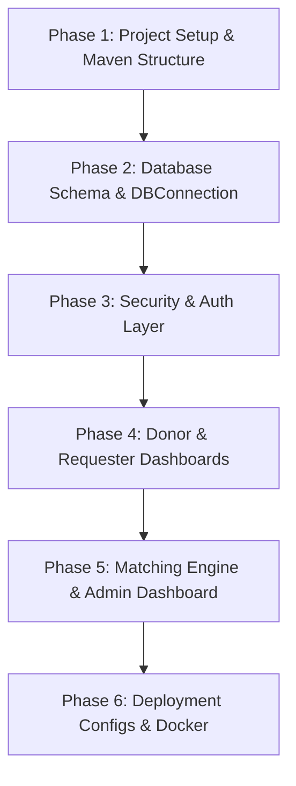

# BloodConnect — PRD & Re-creation Implementation Blueprint

This document contains the complete **Product Requirements Document (PRD)** and step-by-step **End-to-End Implementation Blueprint** to recreate the **BloodConnect** application using any AI coding assistant. 

---

# PART 1: Product Requirements Document (PRD)

## 1. Project Overview
**BloodConnect** is a web-based real-time **Blood Donor and Request Matching System** designed to bridge the gap between blood donors and requesters (patients/hospitals). The application automates the matching of blood requests to eligible donors within the same city, while ensuring donor privacy by masking contact information until an administrator verifies the urgency of the request.

## 2. Core Target Audience & Roles
1. **Donors**: Users who want to register their blood group, location details, availability status, and track donation history.
2. **Requesters**: Users (patients, relatives, or hospital representatives) who need to create blood requests and view matched donors.
3. **Administrators**: Control-layer users who verify blood requests (which reveals donor contact details to verified requests) and monitor the overall database.

## 3. Technology Stack Requirements
To maintain compatibility with standard enterprise containers and cloud builders (such as Railway, Heroku, or local Apache Tomcat), the stack must follow these specifications:
- **Language**: Java 17
- **Web Layer**: JSP (JavaServer Pages 2.3) + Java Servlets 4.0 (`javax.servlet` API)
- **CSS Framework**: Tailwind CSS (Dark-themed glassmorphism styled custom design)
- **Database**: MySQL 8.x
- **Build System**: Maven (WAR packaging)
- **Web Server**: Apache Tomcat 9
- **Libraries**:
  - `mysql-connector-java` (JDBC Database Driver)
  - `jbcrypt` (BCrypt password hashing wrapper)
  - `jstl` (JSP Standard Tag Library for security escaping and page rendering logic)
  - `javax.mail` (For potential email alerts integration)

---

## 4. Key Functional Features

### A. Authentication & Security
- **Role-Based Routing**: A servlet filter (`AuthFilter`) protects routes by prefix:
  - `/donor/*` → Accessible only by `DONOR` role
  - `/request/*` → Accessible only by `REQUESTER` role
  - `/admin/*` → Accessible only by `ADMIN` role
- **Password Security**: Passwords must be hashed using **BCrypt** (10 salt rounds) before database storage. Plaintext passwords must never be stored or directly compared in the DB.
- **XSS Protection**: Every dynamic property outputted in JSPs must be escaped using JSTL `<c:out>` tags.

### B. Donor Profile Management
- **Availability Toggle**: Donors can toggle their availability on/off.
- **Location Normalization**: City selection must use a predefined list of 15 major Indian cities to avoid spelling discrepancies and ensure matching queries work reliably.
- **Donation Recovery Rules**: Donors must not be eligible for matching if their `last_donation_date` is less than 90 days ago.

### C. Matching Engine Logic
When a requester submits a blood request:
1. The system automatically searches for donors where:
   - `blood_group` matches the requested blood type.
   - `city` matches the request location.
   - `is_available` is true.
   - `last_donation_date` is either null or more than 90 days in the past.
2. **Phone Number Masking (Privacy-First)**:
   - On the matching results view, if the request's `is_verified` status is `FALSE`, the donor's contact phone number must be masked (e.g., `999XXXXX99`).
   - Once the Administrator reviews and clicks "Approve" (setting `is_verified` to `TRUE`), the phone number is fully revealed, and a clickable link is generated.

### D. Administrative Verification Queue
- Admin dashboard displays system stats (totals of users, requests, pending verification).
- List of all registered users and requests.
- **Matched Donor Status**: The admin dashboard displays matching records for each request and details the matched donors along with their respective response status (`Accepted Match`, `Declined Match`, `Pending Response`) directly on the request cards to provide monitoring of match progress.
- Actions to:
  - Approve / Verify a request (transitions `is_verified` flag).
  - Update status of requests (`OPEN`, `MATCHED`, `FULFILLED`, `CLOSED`).

### E. Startup Auto-Initialization
- The application must include a `ServletContextListener` that runs on deployment:
  - Checks if the database tables exist.
  - If not, automatically runs the database schema creation SQL script.
  - Seeds the admin user account (`admin@bloodconnect.com` / `Admin@123`) automatically with a pre-computed BCrypt hash if the table exists but the account is missing.

---

# PART 2: End-to-End Implementation Blueprint

Follow these steps sequentially. Feed them to your AI coding assistant.



---

## Phase 1: Project Setup & Maven Structure
Create the standard Maven folder layout:
```text
project-root/
│   pom.xml
└───src/
    └───main/
        ├───java/ (source code)
        └───webapp/ (web files)
            ├───css/
            ├───js/
            └───WEB-INF/
                └───web.xml
```

### Prompt to generate `pom.xml`:
> "Create a `pom.xml` file for a Java 17 Maven Web Application (`war`). Include dependencies for Tomcat 9 (Servlet API 4.0.1 and JSP API 2.3.3 provided), JSTL 1.2, MySQL Connector 8.0.33, jBCrypt 0.4, and JavaMail (javax.mail 1.6.2). Set compiler release to 17, and set build final name to `bloodconnect`. Include the `maven-war-plugin` and `maven-compiler-plugin`."

---

## Phase 2: Database Schema & Auto-Initializer
Create the schema structure and the auto-initialization listener.

### Prompt to generate `schema.sql`:
> "Generate a MySQL database schema file `schema.sql` containing:
> 1. `users` table: id, full_name, email (unique), password_hash, phone, role (enum DONOR, REQUESTER, ADMIN), created_at.
> 2. `donor_profiles` table: donor_id (PK, FK to users), blood_group, age, gender, city, pincode, last_donation_date, is_available.
> 3. `blood_requests` table: request_id, requester_id (FK to users), patient_name, blood_group_needed, units_required, hospital_name, city, urgency, status (enum OPEN, MATCHED, FULFILLED, CLOSED), is_verified (boolean), verified_by (FK to users), created_at.
> 4. `donor_matches` table: match_id, request_id (FK), donor_id (FK), status (enum PENDING, ACCEPTED, DECLINED), matched_at.
> Add optimized indexes for matching query lookups.
> Seed an admin account: email 'admin@bloodconnect.com', phone '9999999999', role 'ADMIN', and BCrypt hash for password 'Admin@123' ($2a$10$UE6oFLim8BTEoFqO/JW3VeTpt1hMd.lsFeqL2HtVUq2a9krwaRJIq)."

### Prompt to generate DB utilities and Auto-Initializer:
> "Write three files:
> 1. `DBConnection.java`: Uses `System.getenv()` to fetch `MYSQLHOST`, `MYSQLPORT`, `MYSQLDATABASE`, `MYSQLUSER`, and `MYSQLPASSWORD` with local fallback values (`localhost`, `3306`, `bloodconnect`, `root`, and empty password) to create a JDBC Connection.
> 2. `CityList.java`: A helper class containing a static final list of 15 major Indian cities (such as Mumbai, Bangalore, Delhi, Chennai, Hyderabad, Kolkata, Pune, Ahmedabad, etc.) to use in dropdown selectors.
> 3. `DatabaseInitializer.java`: A ServletContextListener (`@WebListener`) that connects to the database on start. It runs a query to see if the `users` table exists. If it does not exist, it loads the `/WEB-INF/schema.sql` file and executes all statements sequentially to initialize the database. If the table exists, it checks if the admin user exists; if missing, it seeds it; if present, it updates the password hash to the correct BCrypt hash to ensure it is correct."

---

## Phase 3: Security & Auth Layer
Implement password utility, model classes, DAO layer, and the Servlet authentication filter.

### Prompt to generate authentication utilities:
> "Write the following:
> 1. `PasswordUtil.java`: A BCrypt wrapper using `org.mindrot.jbcrypt.BCrypt` to hash passwords (`hashPassword`) and verify passwords (`checkPassword`).
> 2. `User.java` (Model class representing a user account).
> 3. `UserDAO.java`: Standard JDBC queries to save/retrieve users. Implement `register(User)` returning generated ID, `findByEmail(String)`, `findById(int)`, and `getAllUsers()`.
> 4. `LoginServlet.java`: Handles `/login` paths. Validates fields, uses `UserDAO.findByEmail` to fetch the user, checks the password via `PasswordUtil.checkPassword`, binds user details (`userId`, `role`, `userName`) to the session, and redirects by role (`DONOR` -> `/donor/profile`, `REQUESTER` -> `/request/list`, `ADMIN` -> `/admin/dashboard`).
> 5. `RegisterServlet.java`: Handles `/register` paths. Performs server-side validations: required parameters, email uniqueness, passwords match, and inserts the user record (along with a blank donor profile if registering as a donor).
> 6. `LogoutServlet.java`: Invalidates the HTTP session and redirects to `/`."

### Prompt to generate `AuthFilter.java`:
> "Create an `AuthFilter.java` mapping to `/*`. Exclude static resources (`/css/*`, `/js/*`) and pages `/login`, `/register`, and `/` (home page). Verify user is logged in. Perform role-based access checks based on request paths:
> - Requests starting with `/admin/` require `ADMIN` role.
> - Requests starting with `/donor/` require `DONOR` role.
> - Requests starting with `/request/` require `REQUESTER` role.
> Redirect unauthorized users to login with an appropriate error."

---

## Phase 4: UI & Dashboard Templates
Implement front-end views using Tailwind CSS dark-mode glassmorphism aesthetics. All outputted database variables must use `<c:out>`.

### Prompt to generate Landing Page (`index.jsp`):
> "Create a landing page `index.jsp` for 'BloodConnect' configured with dynamic Tailwind CSS dark-theme and glassmorphism cards. Include sections showing the app features, call-to-action buttons for registration/login, and a footer."

### Prompt to generate Auth Pages (`login.jsp` & `register.jsp`):
> "Generate `login.jsp` and `register.jsp` with dark aesthetics, glassmorphism cards, and a logo. 
> 1. Both pages must include a styled 'Back to Home' navigation button pointing to the index page (`/`) using a left-pointing arrow icon.
> 2. In `register.jsp`, display a role selector (Donor / Requester). If 'Donor' is selected, dynamically toggle visible fields for age, gender, blood group (dropdown), and city (dropdown from `CityList`).
> 3. In `login.jsp`, handle display of error/success attributes using `<c:out>` and JSTL `<c:if>`."

---

## Phase 5: Matching Engine & Administration
Build the donor/requester features, the matching logic, and the admin control panel.

### Prompt to generate Matching and Admin Servlets:
> "Implement:
> 1. `DonorDAO.java` and `DonorProfileServlet.java`: Retrieves and updates the donor profile (pincode, age, gender, blood group, city dropdown, availability boolean, and `last_donation_date`).
> 2. `RequestDAO.java` and `RequestServlet.java`: Allows a requester to post a new request (patient name, blood group, units, hospital, city, urgency) and query matches.
> 3. `MatchDAO.java` and `MatchServlet.java`: Implement the database matching query:
>    `SELECT ... FROM donor_profiles d JOIN users u ON d.donor_id = u.user_id WHERE d.blood_group = ? AND LOWER(d.city) = LOWER(?) AND d.is_available = TRUE AND (d.last_donation_date IS NULL OR DATEDIFF(CURDATE(), d.last_donation_date) >= 90)`
> 4. If a match is queried by a requester, mask the contact numbers in the JSP unless the request's `is_verified` flag is true.
> 5. `AdminDashboardServlet.java` & `AdminVerifyServlet.java` with `admin-dashboard.jsp`: Aggregates active stats, shows a queue of requests awaiting verification, queries all matching donors and their status (`ACCEPTED`, `DECLINED`, `PENDING`) for each request, renders this match list inside each request card (using green for accepted, red for declined, grey for pending), and allows the admin to approve verification (setting `is_verified` to true) and change the request status."

---

## Phase 6: Cloud Deployment Setup
Setup Docker container structures to allow deployment to containers (e.g. Railway or Heroku).

### Prompt to generate Docker configurations:
> "Generate a multi-stage Docker build config:
> 1. Stage 1: Build the WAR package using a Maven image (`maven:3.8.5-openjdk-17`) running `mvn clean package`.
> 2. Stage 2: Copy the packaged `.war` file to the webapps directory of a Tomcat 9 (`tomcat:9-jdk17-temurin`) base image.
> 3. Create an `entrypoint.sh` script to read the container environment port `$PORT` injected by cloud providers, bind it into Tomcat's `conf/server.xml` connector settings dynamically, and run the server."

---

# PART 3: AI Prompt Checklist for Instant Recreation
If you feed these rules to your assistant, you will get the exact copy:

- [ ] **Aesthetic Rule**: "Use dark mode, vibrant red highlights (e.g., `#ef4444` to `#dc2626`), and Tailwind CSS glassmorphic cards (`background: rgba(255, 255, 255, 0.05); backdrop-filter: blur(20px)`)."
- [ ] **Redirection Rule**: "Make sure `/logout` redirects to `/` (welcome page), and accessing protected directories without credentials redirects to `/login`."
- [ ] **Privacy Rule**: "Mask phone numbers as `XXXXXX` on the matching results page if the request is not admin-verified."
- [ ] **Dropdown Rule**: "Cities must be generated using `<c:forEach>` over a Java array constant (`CityList.CITIES`) to prevent mismatch typos during matching queries."
- [ ] **Viewport Rule**: "Use `overflow-y-auto` instead of `overflow-hidden` on auth views to prevent login boxes from clipping on smaller screen dimensions."
- [ ] **Matched Donor Status Rule**: "Ensure the admin dashboard displays a status section for matched donors (green badge for Accepted Match, red badge for Declined Match, grey badge for Pending Response) directly inside each blood request card in the control queue."
